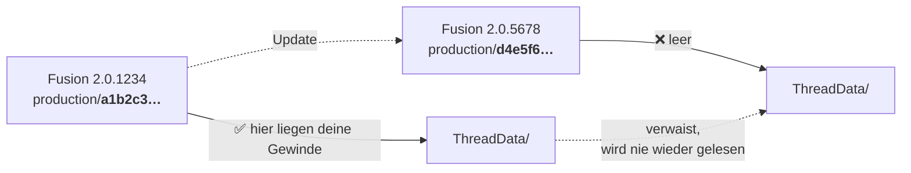

<div align="center">

# 🔩 Fusion360-CustomThread

**Gewindeprofile für den FDM-Druck in Autodesk Fusion — kein Sweep, kein verdrehtes Profil.**

[](LICENSE)
[](LICENSE)
[](#installation)
[](https://www.autodesk.com/products/fusion-360/)
[](#-inhalt-des-pakets)

[English](README.md) · **Deutsch**

</div>

---

> [!CAUTION]
> Diese Gewinde sind für **Schutzkappen, Deko und unbelastete mechanische Spielereien**.
> Niemals für druckführende Teile (CO₂, PET, Sodastream), stromführende Fassungen (E27)
> oder tragende Verschraubungen. Bitte vor dem Drucken [Sicherheit](#-sicherheit) lesen.

---

## Inhalt

- [Warum es das gibt](#warum-es-das-gibt)
- [Inhalt des Pakets](#-inhalt-des-pakets)
- [Installation](#installation)
- [Toleranzklassen](#toleranzklassen)
- [Das Update-Problem](#das-update-problem)
- [Eigene Gewinde bauen](#eigene-gewinde-bauen)
- [Wie so eine Gewinde-XML funktioniert](#wie-so-eine-gewinde-xml-funktioniert)
- [Roadmap](#roadmap)
- [Sicherheit](#-sicherheit)
- [Herkunft & Lizenz](#herkunft--lizenz)

---

## Warum es das gibt

Zwei Probleme, eine Lösung.

**Problem 1 — Fusions Standardgewinde sind aus Metall gedacht.** Sie setzen Fräse und
Gewindebohrer voraus. Druckt man sie in PLA, klemmen sie: Kunststoff dehnt sich beim
Drucken aus, die Düse verrundet jede scharfe Spitze, und die erste Schicht quillt nach
außen. Was in Stahl passt, sitzt in Plastik fest.

**Problem 2 — ein Gewinde von Hand zu modellieren ist eine Qual.** Der übliche Rat lautet
*Profil zeichnen, Spirale anlegen, Erhebung entlang Pfad*. Wer es probiert hat, kennt das
Ergebnis: Das Profil verdreht sich unterwegs und das Teil ist unbrauchbar.[^forum]

Dieses Projekt umgeht beides. Das Gewinde wird **mathematisch korrekt von Fusions eigenem
Gewinde-Werkzeug** aus einer Definitionsdatei erzeugt — kein Zeichnen, kein Sweep, kein
Verdrehen. Und die Zahlen in dieser Datei berücksichtigen bereits, wie sich FDM verhält.

> [!NOTE]
> Hier ist kein Plugin und keine ausführbare Datei drin. Das sind schlichte XML-Textdateien,
> die Fusion beim Start einliest. Du kannst jede einzelne im Editor öffnen und nachlesen,
> was sie tut.

---

## 📦 Inhalt des Pakets

41 Gewindegrößen in 9 Dateien, alle im Fusion-Dropdown mit `[3D-Print]` vorangestellt:

| # | Datei | Gewinde | Ø | Steigung | Winkel | Wofür |
|:-:|-------|---------|--:|---------:|-------:|-------|
| 1 | `01_TR21x4_Sodastream.xml` | TR21×4 | 21 mm | 4 mm | 30° | Sodastream-Zylinder |
| 2 | `02_DIN477_CO2.xml` | W 21,8 × 1/14" | 21,8 mm | 14 TPI | 55° | CO₂- / Gasflaschen (DIN 477) |
| 3 | `03_PCO1881_PET.xml` | PCO 1881 | 28 mm | 2,508 mm[^pitch] | 60° | PET-Getränkeflaschen |
| 4 | `04_G34_Gardena.xml` | G 3/4" | 26,441 mm | 14 TPI | 55° | Gartenschlauch, Wasserhahn, Gardena |
| 5 | `05_UNC_1-4_Tripod.xml` | 1/4"-20 UNC | 6,35 mm | 20 TPI | 60° | Kamera- / Fotostativ |
| 6 | `06_UNC_3-8_Tripod.xml` | 3/8"-16 UNC | 9,525 mm | 16 TPI | 60° | Profi-Stativ |
| 7 | `07_E27_LampSocket.xml` | E27 | 27 mm | 3,629 mm | 60° | Lampenfassung (nur Deko!) |
| 8 | `08_Trapezoidal_FDM_TR8-TR150.xml` | **TR8×2 → TR150×16** | 8–150 mm | 2–16 mm | **45°** | 33 Größen. Spindeln, Klemmen, große Deckel |
| 9 | `09_TR8x2_ISO30.xml` | TR8×2 | 8 mm | 2 mm | 30° | Normgerechtes Trapezgewinde |

Dazu:

- 📐 [`examples/CO2-Gewindeschutzkappe.f3d`](examples/) — eine fertige Schutzkappe zum Anschauen
- 🔍 [`tools/find-threaddata.bat`](tools/) — findet den ThreadData-Ordner der *laufenden* Fusion-Instanz
- 🤖 [`docs/ai-assistant-prompt.de.md`](docs/) — Prompt, der jeden Chatbot zum Gewinde-Generator macht
- 📚 [`legacy/`](legacy/) — die ursprüngliche Forum-Fassung samt Umbenennungs-Tabelle

> [!TIP]
> Datei **#8** ist die interessanteste. 33 Trapezgrößen mit **45° Flankenwinkel** — flachere
> Flanken drucken sich ohne Stützen und schälen beim Überhang nicht ab. Autodesk selbst
> verwendet 45° für seine *Inch Tapping Threads for Plastics*. Das ist also keine Bastelei,
> sondern dieselbe Überlegung, auf mehr Größen angewendet.

---

## Installation

Fusion lädt Gewindedefinitionen aus einem Ordner **innerhalb seines eigenen
Versionsverzeichnisses**. Einen benutzereigenen Ablageort dafür gibt es nicht.

<details open>
<summary><b>🪟 Windows</b></summary>

1. **Fusion starten** und laufen lassen.
2. **`tools/find-threaddata.bat`** doppelklicken.
   Das Tool findet den Ordner der *laufenden* Instanz und öffnet ihn im Explorer.
3. Alles aus **`threads/`** in dieses Fenster kopieren.
4. **Fusion komplett schließen und neu starten.**
5. <kbd>ERSTELLEN</kbd> → <kbd>Gewinde</kbd> → Haken bei **Modelliert** → dein Gewinde unter **Typ** wählen.

Lieber von Hand? Das hier in die Explorer-Adressleiste einfügen:

```text
%LOCALAPPDATA%\Autodesk\webdeploy\production
```

Dann den zuletzt geänderten Ordner öffnen und weiter nach
`Fusion\Server\Fusion\Configuration\ThreadData`.

</details>

<details>
<summary><b>🍎 macOS</b></summary>

Die `.bat` ist Windows-only. Im Finder <kbd>⌘</kbd><kbd>⇧</kbd><kbd>G</kbd> drücken und
eingeben:

```text
~/Library/Application Support/Autodesk/webdeploy/production
```

Den neuesten Versionsordner öffnen, dann weiter nach
`Autodesk Fusion.app/Contents/Libraries/Applications/Fusion/Fusion/Server/Fusion/Configuration/ThreadData`.

Dateien aus `threads/` dorthin kopieren, Fusion neu starten.

</details>

<details>
<summary><b>🛡️ Update-fest: ThreadKeeper benutzen</b></summary>

[ThreadKeeper](https://github.com/thomasa88/ThreadKeeper) von Thomas Axelsson ist ein
kostenloses Fusion-Add-in (MIT), das Gewindedefinitionen **nach jedem Fusion-Update
automatisch wiederherstellt**. Es bringt selbst keine Gewinde mit — dafür gibt es dieses
Projekt.

1. ThreadKeeper installieren (Autodesk App Store oder GitHub Releases).
2. *UTILITIES → THREADKEEPER → Open ThreadKeeper directory*
3. Inhalt von `threads/` dort ablegen.
4. Fertig. Bei jedem Fusion-Start werden sie neu eingespielt.

</details>

> [!IMPORTANT]
> Die Gewinde erscheinen erst nach einem **kompletten Neustart** von Fusion. Kein Neuladen,
> kein neues Dokument — Programm beenden und neu starten.

---

## Toleranzklassen

Jede Datei bringt mehrere Passungen mit. Auswahl in Fusion unter **Klasse** — es muss nichts
bearbeitet werden.

| Klasse | Gesamtspiel | Fühlt sich an wie | Nimm sie, wenn |
|--------|------------:|-------------------|----------------|
| `0.15mm (Tight)` | 0,15 mm | straff, braucht Handkraft, kein Wackeln | dein Drucker gut kalibriert ist |
| `0.20mm (Safe)` | 0,20 mm | dreht leicht, minimal Spiel | älterer/schneller Drucker, große Ø |

Zur Einordnung: Ein ganz normales **M20×2,5 in 6H/6g** — die Schraube aus dem Baumarkt —
hat am Flankendurchmesser zwischen 0,042 mm und rund 0,42 mm Luft, typisch etwa 0,2 mm.
0,15 mm liegt damit **in derselben Größenordnung wie eine serienmäßige
Metallverschraubung**, eher am strammen Ende.

> [!WARNING]
> Nicht mit ISO-286-Toleranzen oder „H7" argumentieren. Die beschreiben *glatte* Maße —
> Bohrungen und Wellen. Gewinde laufen über ISO 965 (6H/6g), und H7 hält ohnehin kein
> FDM-Drucker.

Was dich wirklich begrenzt, ist das Verfahren, nicht eine Norm:

- eine 0,4er Düse **kann** keine scharfe Gewindespitze legen — die Flanken werden verrundet
- bei 0,2 mm Schicht und 2,7 mm Steigung ist eine Flanke eine **13-stufige Treppe**, keine Gerade
- Elefantenfuß drückt die ersten Schichten nach außen
- Schwund: PETG und ABS brauchen spürbar mehr Spiel als PLA
- **Orientierung zählt** — liegend gedruckt braucht mehr Spiel als stehend

**Erst einen kurzen Testring drucken.** Acht Millimeter Gewinde sagen dir in 20 Minuten
mehr als jede Tabelle.

---

## Das Update-Problem

Jedes Fusion-Update installiert in einen **neuen Ordner mit neuem Hash** — und die
Gewindedefinitionen wandern nicht mit:



Deine Dateien sind nicht gelöscht — sie liegen noch im alten Ordner, den Fusion nur nicht
mehr liest.

Drei Wege damit umzugehen:

- [x] **Manuell** — `find-threaddata.bat` nochmal laufen lassen und neu kopieren. Geht immer.
- [x] **ThreadKeeper** — ein fremdes Add-in erledigt es bei jedem Start ([oben](#installation))
- [ ] **Eigenes Add-in** — geplant, siehe [Roadmap](#roadmap)

---

## Eigene Gewinde bauen

Fusions Gewinde-Maschinerie ist begrenzter, als sie aussieht — und genau diese Grenzen zu
kennen, macht eigene Gewinde einfach.

### Was geht und was nicht

| ✅ Möglich | ❌ Unmöglich |
|-----------|-------------|
| Jeder Flankenwinkel (spitz → fast flach) | **Asymmetrische Profile** — Sägezahn / Buttress |
| Jede Steigung | **Echte Rundprofile** (echtes E27, Rd-Gewinde) |
| Jede Gewindetiefe | Unterschiedliche Kopf- und Fußverrundung |
| Jeder Durchmesser, jedes Spiel | Variable Steigung |
| Spitz, Trapez, fast rechteckig | Mehrgängig & Linksgewinde<sup>*</sup> |

<sup>*</sup> <sub>Mehrgängig und Linksgewinde gibt es sehr wohl — die stellst du im Fusion-Dialog ein, nicht in der XML.</sub>

Es gibt genau **einen** `<Angle>`, und der gilt für *beide* Flanken. Diese eine Tatsache
erklärt jeden Eintrag in der rechten Spalte. Du willst ein echtes Sägezahngewinde? Dann
zurück zu Spirale + Sweep.

### Es gibt nur 5 Grundformen

Fusion liefert 18 Definitionsdateien mit — die verteilen sich auf fünf Flankenwinkel:

| Winkel | Standarddateien | Guter Ausgangspunkt für |
|-------:|-----------------|-------------------------|
| **60°** | ISO Metric, ANSI Metric M, ANSI Unified, GB Metric, Inch Tapping, Metric Forming, AFBMA Locknuts, DIN Wood Screw, GOST Self-tapping | Alltags-Spitzgewinde |
| **55°** | ISO / BSP / DIN / JIS / GB Pipe Threads | Whitworth-Familie, Rohr, Schlauch |
| **45°** | Inch Tapping Threads **for Plastics** | 🖨️ FDM-freundlich |
| **30°** | ISO Metric Trapezoidal, Metric Tapping Threads **for Plastics** | Bewegungsgewinde, Deckel |
| **29°** | ACME Screw Threads | Zoll-Trapez |

### 🤖 Die Rechnerei einem Chatbot überlassen

In [`docs/ai-assistant-prompt.de.md`](docs/ai-assistant-prompt.de.md) liegt ein
vollständiger System-Prompt. Rein in ChatGPT, Claude oder Gemini, und du beschreibst
einfach, was du drucken willst:

> **Du:** Hey ich will einen Deckel für eine Wasserflasche drucken, was ist das für ein Gewinde?
>
> **Assistent:** Das ist mit hoher Wahrscheinlichkeit ein PCO 1881 — der Standard bei
> praktisch allen PET-Einwegflaschen seit etwa 2010. 28 mm Außendurchmesser, 60°
> Spitzprofil. Eine Frage vorweg: Druckst du nur den Deckel und schraubst ihn auf eine
> echte Flasche — oder druckst du auch den Flaschenhals selbst?

Diese Frage ist kein Smalltalk. Sie entscheidet, **wo das Spiel hinkommt**:

| Fall | Du druckst | Spiel kommt auf |
|:----:|------------|-----------------|
| **A** | nur den Deckel, Flasche ist echt | nur `internal` — `external` muss exakt auf Nennmaß bleiben, sonst passt die echte Flasche nicht |
| **B** | nur den Bolzen, Gegenstück ist echt | nur `external` |
| **C** | beide Teile | halbes Spiel auf jede Seite |

> [!NOTE]
> Eine fehlerhafte XML lässt nicht nur das eigene Gewinde verschwinden — sie kann **Fusions
> komplette Gewindeliste abschießen**, Standardgewinde inklusive. Immer eine Kopie behalten
> und KI-Output prüfen, bevor er in den Ordner wandert.

---

## Wie so eine Gewinde-XML funktioniert

<details>
<summary><b>Aufklappen — Feld für Feld</b></summary>

Die Datei enthält **keine Form**. Sie enthält Zahlen. Fusion zeichnet daraus immer dieselbe
Grundform: ein symmetrisches, oben und unten gekapptes V.

```
     MajorDia/2  ─────┬───────┐   ← Kappung oben
                      │  ╱ ╲  │
     PitchDia/2  ─────│ ╱   ╲ │   ← Angle = Öffnungswinkel (voll)
                      │╱     ╲│
     MinorDia/2  ─────┴───────┘   ← Kappung unten
                      │←Pitch→│
```

Die theoretische Profilhöhe folgt aus Winkel und Steigung:

$$H = \frac{P}{2 \cdot \tan(A/2)}$$

…und wie viel von diesem `V` stehen bleibt, bestimmt die Differenz aus `MajorDia` und
`MinorDia`. Genau deshalb **ist** ein stark gekapptes 30°-V ein Trapezgewinde.

| Element | Bedeutung | Wirkung beim Druck |
|---------|-----------|--------------------|
| `<Angle>` | voller Flankenöffnungswinkel | 60° metrisch/UNC · 55° Whitworth · 30° ISO-Trapez · **45° FDM** |
| `<Pitch>` / `<TPI>` | mm pro Gang / Gänge pro Zoll | unter ~1,5 mm verschmiert FDM das Profil |
| `<MajorDia>` | Außendurchmesser | bei `internal` größer, bei `external` kleiner → das ist das Spiel |
| `<PitchDia>` | Flankendurchmesser | trägt die eigentliche Kraft |
| `<MinorDia>` | Kerndurchmesser | |
| `<TapDrill>` | Bohrerdurchmesser | nur bei `internal`, für Fusions Bohrungswerkzeug |
| `<Class>` | freier Text | hier zweckentfremdet als **Spiel-Wähler** |
| `<Gender>` | `internal` / `external` | beide je Klasse nötig |
| `<SortOrder>` | Position im Dropdown | Autodesk belegt 1–63 |
| `<ExternalOnly>` | blendet Innengewinde aus | für Gewinde, die es nur als Bolzen gibt |

Harte Regel: `MajorDia > PitchDia > MinorDia`. Wer das verletzt, stülpt das Profil nach innen.

</details>

---

## Roadmap

**v1.0 — die Daten in Ordnung bringen**

- [ ] `SortOrder` auf 200+ (kollidiert aktuell mit Autodesks 1–63)
- [ ] Toleranzklassen vereinheitlichen → `0.10 stramm` / `0.15 Standard` / `0.20 leichtgängig`
- [ ] Spiel sauber nach Fall A / B / C aufteilen
- [ ] TR8×2-Konflikt auflösen (30° und 45° liegen beide bei)
- [ ] Steigung von PCO 1881 verifizieren[^pitch]
- [ ] CI-Validierung aller XML-Dateien

**v2.0 — das Add-in**

- [ ] Gewinde beim Fusion-Start wiederherstellen (update-fest)
- [ ] Menü: Status, Force-Sync, Bibliothek öffnen
- [ ] **Einfüge-Box**: KI-generierte XML einfügen, prüfen lassen, speichern
- [ ] Knopf „Prompt für KI kopieren" — schließt den Kreis

**v2.1 — Kür**

- [ ] Druckbares Kalibrier-Testteil für die Toleranzen
- [ ] Grafische Profil-Vorschau

---

## ⚠️ Sicherheit

> [!CAUTION]
> **Die Verwendung erfolgt ausdrücklich auf eigene Gefahr. Bitte schalte deinen gesunden
> Menschenverstand ein.**
>
> 1. **Keine technischen Verschraubungen.** Diese Gewinde sind für Schutzkappen,
>    Staubschutz und unbelastete mechanische Spielereien. Nichts, was halten muss.
> 2. **Gefahr durch Druck.** Gewinde für PET-Flaschen, Sodastream oder Gasflaschen (CO₂)
>    stehen im Original unter erheblichem Druck. Ein gedrucktes Kunststoffteil hält dem
>    **nicht** stand. Berstende Teile verursachen schwere Augen- und Gesichtsverletzungen.
>    Niemals für druckführende Bauteile.
> 3. **Lebensgefahr durch Strom.** Das E27-Gewinde darf niemals für echte stromführende
>    Fassungen verwendet werden. Stromschlag- und Brandgefahr — PLA und PETG erweichen bei
>    Lampenwärme.
> 4. **Nicht lebensmittelecht.** In den Schichtrillen setzen sich Bakterien fest, die sich
>    nicht auswaschen lassen.
> 5. **Keine Haftung.** Ich habe diese Dateien nach bestem Wissen erstellt, bin jedoch nicht
>    allmächtig. Keinerlei Haftung für Schäden an Hardware, Material oder Personen.
>
> Wer sich unsicher ist: die Dateien bitte **nicht** für sicherheitsrelevante Anwendungen
> nutzen.

Sicherheitsbewusst? Jede Datei hier ist Klartext — lies sie. Und prüfen darfst du das Ganze
gern bei [VirusTotal](https://www.virustotal.com/gui/home/upload).

---

## Herkunft & Lizenz

Entstanden unter intensiver Zuhilfenahme von KI, um die Brücke zwischen klassischer Mechanik
und 3D-Druck zu schlagen. Der Weg war: analysieren, welche Gewinde in Fusion für den Alltag
fehlen → Autodesks originale `ThreadData`-Dateien als Basis auswerten → die Profile so
umrechnen, dass die materialbedingte Ausdehnung beim FDM-Druck (0,15 mm / 0,20 mm) direkt
im Gewindegang steckt.

- **Code und Werkzeuge** — MIT
- **Gewindedefinitionen** — CC BY 4.0
- Verwandt: [ThreadKeeper](https://github.com/thomasa88/ThreadKeeper) ·
  [CustomThreads](https://github.com/BalzGuenat/CustomThreads) ·
  [Fusion-360-FDM-threads](https://github.com/DurbansPoison/Fusion-360-FDM-threads)

Falsche Zahl gefunden? [Issue aufmachen](../../issues) — gemessene Werte sind besonders
willkommen.

<div align="center">

**Viel Erfolg beim sicheren Konstruieren.** 🖨️

</div>

[^forum]: Das Verdreh-Problem beim Sweep wird hier ausführlich diskutiert:
    [forum.drucktipps3d.de](https://forum.drucktipps3d.de/forum/thread/45313-erhebung-entlang-pfad-verdreht-profil/)

[^pitch]: Die mitgelieferte Datei nennt `2,508 mm`, während PCO 1881 üblicherweise mit
    ~2,7 mm angegeben wird. Zur Prüfung vorgemerkt — siehe [Roadmap](#roadmap). Vor dem
    Verlassen darauf bitte nachmessen.
