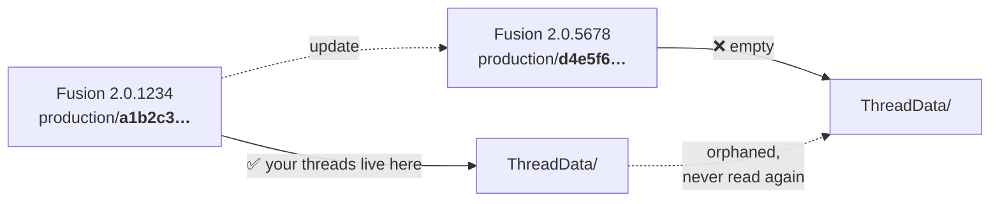

<div align="center">

# 🔩 Fusion360-CustomThread

**FDM-optimised thread profiles for Autodesk Fusion — no more sweeping, no more twisted profiles.**

[](https://github.com/grapefruit89/Fusion360-CustomThread/actions/workflows/validate.yml)
[](https://github.com/grapefruit89/Fusion360-CustomThread/discussions)
[](LICENSE)
[](LICENSE)
[](#installation)
[](https://www.autodesk.com/products/fusion-360/)
[](#-whats-in-the-box)

**English** · [Deutsch](README.de.md)

</div>

---

> [!CAUTION]
> These threads are for **dust caps, decoration and unloaded mechanical toys**.
> Never use them for pressurised parts (CO₂, PET, SodaStream), live electrical
> sockets (E27), or load-bearing joints. See [Safety](#-safety) before you print.

---

## Contents

- [Why this exists](#why-this-exists)
- [What's in the box](#-whats-in-the-box)
- [Installation](#installation)
- [Tolerance classes](#tolerance-classes)
- [The update problem](#the-update-problem)
- [Rolling your own thread](#rolling-your-own-thread)
- [How a thread XML actually works](#how-a-thread-xml-actually-works)
- [Community](#-community)
- [Roadmap](#roadmap)
- [Safety](#-safety)
- [Credits & licence](#credits--licence)

---

## Why this exists

Two problems, one solution.

**Problem 1 — Fusion's stock threads are made of metal.** They assume a milling machine
and a tap. Print one in PLA and it seizes: molten plastic swells, the nozzle rounds off
every sharp crest, and the first layer flares out. What fits in steel binds in plastic.

**Problem 2 — modelling a thread by hand is miserable.** The usual advice is *draw a
profile, make a helix, sweep it*. Anyone who has tried knows the profile twists along the
path and the result is unusable.[^forum]

This repo sidesteps both. The thread is generated **mathematically by Fusion's own thread
tool** from a definition file — no sketching, no sweeping, no twisting — and the numbers in
that file already account for how FDM behaves.

> [!NOTE]
> Nothing here is a plugin or an executable. These are plain XML text files that Fusion
> reads on startup. You can open every one of them in Notepad and check what it does.

---

## 📦 What's in the box

41 thread sizes across 9 definition files, all prefixed `[3D-Print]` in Fusion's dropdown:

| # | File | Thread | Ø | Pitch | Angle | Used for |
|:-:|------|--------|--:|------:|------:|----------|
| 1 | [`01_TR21x4_Sodastream.xml`](threads/01_TR21x4_Sodastream.xml) | TR21×4 | 21 mm | 4 mm | 30° | SodaStream cylinders |
| 2 | [`02_DIN477_CO2.xml`](threads/02_DIN477_CO2.xml) | W 21,8 × 1/14" | 21.8 mm | 14 TPI | 55° | CO₂ / gas bottles (DIN 477) |
| 3 | [`03_PCO1881_PET.xml`](threads/03_PCO1881_PET.xml) | PCO 1881 | 28 mm[^dia] | 2.7 mm | 60° | PET drink bottles |
| 4 | [`04_G34_Gardena.xml`](threads/04_G34_Gardena.xml) | G 3/4" | 26.441 mm | 14 TPI | 55° | Garden hose, taps, Gardena |
| 5 | [`05_UNC_1-4_Tripod.xml`](threads/05_UNC_1-4_Tripod.xml) | 1/4"-20 UNC | 6.35 mm | 20 TPI | 60° | Camera / photo tripod |
| 6 | [`06_UNC_3-8_Tripod.xml`](threads/06_UNC_3-8_Tripod.xml) | 3/8"-16 UNC | 9.525 mm | 16 TPI | 60° | Pro tripod |
| 7 | [`07_E27_LampSocket.xml`](threads/07_E27_LampSocket.xml) | E27 | 27 mm | 3.629 mm | 60° | Lamp sockets (decor only!) |
| 8 | [`08_Trapezoidal_FDM_TR8-TR150.xml`](threads/08_Trapezoidal_FDM_TR8-TR150.xml) | **TR8×2 → TR150×16** | 8–150 mm | 2–16 mm | **45°** | 33 sizes. Lead screws, clamps, big lids |
| 9 | [`09_TR8x2_ISO30.xml`](threads/09_TR8x2_ISO30.xml) | TR8×2 | 8 mm | 2 mm | 30° | Standards-compliant trapezoidal[^tr8] |

Plus:

- 📐 [`examples/CO2-Gewindeschutzkappe.f3d`](examples/) — a finished protective cap to look at
- 🔍 [`tools/find-threaddata.bat`](tools/) — finds the ThreadData folder of your *running* Fusion
- 🤖 [`docs/ai-assistant-prompt.de.md`](docs/) — a system prompt that turns any chatbot into a thread generator
- 📚 [`legacy/`](legacy/) — the original forum release plus a rename mapping table
- 📐 [`docs/profilgeometrie.de.md`](docs/profilgeometrie.de.md) — how Fusion turns five numbers into a profile, verified against the standards (German)

> [!TIP]
> File **#8** is the one to look at first. 33 trapezoidal sizes at a **45° flank angle** —
> flatter flanks print without supports and don't peel on the overhang. Autodesk uses 45°
> for its own *Inch Tapping Threads for Plastics*, so this isn't a hack: it's the same
> reasoning, applied to a wider range.

---

## Installation

Fusion loads thread definitions from a folder **inside its own versioned install
directory**. There is no user-level location for them.

<details open>
<summary><b>🪟 Windows</b></summary>

1. **Start Fusion** and leave it running.
2. Double-click **`tools/find-threaddata.bat`**.
   It locates the folder belonging to the *running* instance and opens it in Explorer.
3. Copy everything from **`threads/`** into that window.
4. **Fully quit and restart Fusion.**
5. <kbd>CREATE</kbd> → <kbd>Thread</kbd> → tick **Modeled** → pick your thread under **Type**.

Prefer to do it by hand? Paste this into the Explorer address bar:

```text
%LOCALAPPDATA%\Autodesk\webdeploy\production
```

then open the folder that was modified most recently and go to
`Fusion\Server\Fusion\Configuration\ThreadData`.

</details>

<details>
<summary><b>🍎 macOS</b></summary>

The `.bat` file is Windows-only. Navigate manually in Finder — press
<kbd>⌘</kbd><kbd>⇧</kbd><kbd>G</kbd> and enter:

```text
~/Library/Application Support/Autodesk/webdeploy/production
```

Open the most recent version folder, then
`Autodesk Fusion.app/Contents/Libraries/Applications/Fusion/Fusion/Server/Fusion/Configuration/ThreadData`.

Copy the files from `threads/` there and restart Fusion.

</details>

<details>
<summary><b>🛡️ Survives updates: use ThreadKeeper</b></summary>

[ThreadKeeper](https://github.com/thomasa88/ThreadKeeper) by Thomas Axelsson is a free
MIT-licensed Fusion add-in that restores thread definitions **every time Fusion updates**.
It ships no threads of its own — that's what this repo is for.

1. Install ThreadKeeper — **preferably from [GitHub Releases](https://github.com/thomasa88/ThreadKeeper/releases)**, not the Autodesk App Store.
2. *UTILITIES → THREADKEEPER → Open ThreadKeeper directory*
3. Drop the contents of `threads/` in there.
4. Done. It re-installs them on every Fusion start.

> [!TIP]
> **Why GitHub over the App Store:** Autodesk's review takes weeks. In early 2025 the App
> Store build was broken for over a month (error dialog on startup) while GitHub already had
> the fix. If ThreadKeeper throws a Python error at you, grab the current GitHub release
> first — you have to uninstall the App Store version for that.

</details>

> [!IMPORTANT]
> The threads only appear **after a full restart** of Fusion. Not a reload, not a new
> document — quit the application and start it again.

---

## Tolerance classes

Every file ships **six fits**. Pick them in Fusion under **Class** — no need to edit
anything. Labels are in German; the table below translates them.

The question that decides everything: **is the counterpart a real object, or are you
printing both halves?**

| Class | German label means | Offset int. / ext. | Result |
|-------|--------------------|-------------------:|--------|
| `0.10 mm - stramm (gegen echtes Teil)` | tight, vs. a real part | +0.10 / −0.10 | 0.10 mm against the real part |
| `0.15 mm - Standard (gegen echtes Teil)` | standard, vs. a real part | +0.15 / −0.15 | 0.15 mm ← **default** |
| `0.20 mm - locker (gegen echtes Teil)` | loose, vs. a real part | +0.20 / −0.20 | 0.20 mm against the real part |
| `0.10 mm - stramm (beide gedruckt)` | tight, both printed | +0.05 / −0.05 | 0.10 mm between your two parts |
| `0.15 mm - Standard (beide gedruckt)` | standard, both printed | +0.075 / −0.075 | 0.15 mm between your two parts |
| `0.20 mm - locker (beide gedruckt)` | loose, both printed | +0.10 / −0.10 | 0.20 mm between your two parts |

**Why two cases and not three:** when the counterpart is real you print either the cap *or*
the bolt, and Fusion only ever uses the half of the class that matches your body — so
"printed cap" and "printed bolt" need identical numbers. Only when **both** halves come off
the printer do the deviations add up, and then each side gets half.

> [!IMPORTANT]
> **Behaviour change from v0.9.0.** The old classes added *twice* the stated value to the
> internal thread (`0.15mm (Tight)` really meant +0.30 mm) and one times to the external —
> 0.45 mm in total instead of 0.15 mm. The new classes mean what they say. If you used to
> print "Tight", `0.15 Standard` will feel noticeably firmer. If it binds: **go up one step.**

For scale: an ordinary **M20×2.5 in 6H/6g** — the bolt from the hardware store — has
between 0.042 mm and roughly 0.42 mm of clearance at the pitch diameter, typically ~0.2 mm.
So 0.15 mm sits **in the same ballpark as a production metal fastener**, towards the tight
end.

> [!NOTE]
> **Why you won't find "H7" anywhere here.** ISO 286 grades like H7 describe *plain*
> dimensions — bores and shafts. Threads follow a different standard, ISO 965, with classes
> such as 6H/6g. The two systems don't convert into one another. And H7 at Ø 28 mm would be
> 0.021 mm — no FDM printer holds that, and a thread wouldn't need it anyway.

What actually limits you is the process, not a standard:

- a 0.4 mm nozzle **cannot** lay a sharp crest — flanks come out rounded
- at 0.2 mm layers and 2.7 mm pitch, a flank is a **13-step staircase**, not a line
- elephant's foot flares the first layers outwards
- shrinkage: PETG and ABS need noticeably more clearance than PLA
- **orientation matters** — a thread printed lying down needs more clearance than one
  printed standing up

**Print a short test ring first.** Eight millimetres of thread tells you in 20 minutes what
no table can.

---

## The update problem

Every Fusion update installs into a **new folder with a new hash**, and the thread
definitions do not come along:



Your files aren't deleted — they're stranded in the old folder that Fusion no longer reads.

Three ways to deal with it:

- [x] **Manual** — run `find-threaddata.bat` again and re-copy. Always works.
- [x] **ThreadKeeper** — a third-party add-in does it for you on every start ([above](#installation))
- [ ] **Our own add-in** — planned, see [Roadmap](#roadmap)

---

## Rolling your own thread

Fusion's thread engine is more limited than it looks, and knowing the limits is what makes
custom threads easy.

### What you can and cannot build

| ✅ Possible | ❌ Impossible |
|------------|--------------|
| Any flank angle (sharp → almost flat) | **Asymmetric profiles** — buttress / sawtooth |
| Any pitch | **True round profiles** (real E27, Rd threads) |
| Any thread depth | Different crest and root radii |
| Any diameter and clearance | Variable pitch |
| Pointed, trapezoidal, near-square | Multi-start & left-hand<sup>*</sup> |

<sup>*</sup> <sub>Multi-start and left-hand threads exist — you set them in Fusion's dialog, not in the XML.</sub>

There is exactly **one** `<Angle>` and it applies to *both* flanks. That single fact
explains every entry in the right-hand column. Want a real buttress thread? You're back to
helix + sweep.

### Only 5 base forms exist

Fusion ships 18 definition files, but they collapse into five flank angles:

| Angle | Stock files | Good starting point for |
|------:|-------------|-------------------------|
| **60°** | ISO Metric, ANSI Metric M, ANSI Unified, GB Metric, Inch Tapping, Metric Forming, AFBMA Locknuts, DIN Wood Screw, GOST Self-tapping | Everyday V-threads |
| **55°** | ISO / BSP / DIN / JIS / GB Pipe Threads | Whitworth family, pipes, hose |
| **45°** | Inch Tapping Threads **for Plastics** | 🖨️ FDM-friendly |
| **30°** | ISO Metric Trapezoidal, Metric Tapping Threads **for Plastics** | Motion threads, lids |
| **29°** | ACME Screw Threads | Imperial trapezoidal |

### 🤖 Let a chatbot do the maths

[`docs/ai-assistant-prompt.de.md`](docs/ai-assistant-prompt.de.md) contains a complete
system prompt. Paste it into ChatGPT, Claude or Gemini and describe what you want to print:

> **You:** I want to print a cap for a water bottle — what thread is that?
>
> **Assistant:** Almost certainly PCO 1881 — the standard on virtually every PET bottle
> since about 2010. 28 mm outer diameter, 60° profile. One question first: are you printing
> only the cap and screwing it onto a real bottle, or the bottle neck too?

That question isn't small talk. It decides **where the clearance goes**:

| Case | You print | Clearance applied to |
|:----:|-----------|----------------------|
| **A** | cap only, bottle is real | `internal` only — `external` must stay at nominal, or the real bottle won't fit |
| **B** | bolt only, counterpart is real | `external` only |
| **C** | both parts | half the clearance on each side |

> [!NOTE]
> A malformed XML doesn't just hide your own thread — it can wipe out **Fusion's entire
> thread list**, stock threads included. Always keep a copy, and validate what an AI hands
> you before dropping it in.

---

## How a thread XML actually works

<details>
<summary><b>Click to expand — field by field</b></summary>

The file contains **no shape**. It contains numbers. Fusion always draws the same base
form: a symmetric V, truncated top and bottom.

```
     MajorDia/2  ─────┬───────┐   ← truncated crest
                      │  ╱ ╲  │
     PitchDia/2  ─────│ ╱   ╲ │   ← Angle = full included angle
                      │╱     ╲│
     MinorDia/2  ─────┴───────┘   ← truncated root
                      │←Pitch→│
```

The theoretical profile height follows from angle and pitch:

$$H = \frac{P}{2 \cdot \tan(A/2)}$$

…and how much of that `V` survives is set by the difference between `MajorDia` and
`MinorDia`. That's why a heavily truncated 30° V **is** a trapezoidal thread.

| Element | Meaning | Effect when printing |
|---------|---------|----------------------|
| `<Angle>` | full included flank angle | 60° metric/UNC · 55° Whitworth · 30° ISO trapezoidal · **45° FDM** |
| `<Pitch>` / `<TPI>` | mm per turn / turns per inch | below ~1.5 mm FDM smears the profile |
| `<MajorDia>` | outer diameter | larger on `internal`, smaller on `external` → that's the clearance |
| `<PitchDia>` | pitch diameter | carries the actual load |
| `<MinorDia>` | root diameter | |
| `<TapDrill>` | drill diameter | `internal` only, for Fusion's hole tool |
| `<Class>` | free-text label | repurposed here as a **clearance picker** |
| `<Gender>` | `internal` / `external` | both required per class |
| `<SortOrder>` | position in the dropdown | Autodesk occupies 1–63 |
| `<ExternalOnly>` | hides internal option | for threads that only exist as a bolt |

Hard rule: `MajorDia > PitchDia > MinorDia`. Violate it and the profile turns inside out.

</details>

---

## 💬 Community

Questions, prints and real-world numbers belong in
**[Discussions](../../discussions)** — nothing gets lost there and others can find it later.

| Category | For |
|----------|-----|
| [📏 Toleranzen / Clearances](../../discussions/1) | **The important one.** Which class works on your printer with your material? This can't be calculated, only collected. |
| [❓ Q&A](../../discussions/categories/q-a) | "Which class do I take for …?", "How do I measure this?" |
| [🖨️ Show and tell](../../discussions/categories/show-and-tell) | Show what you built. Photos welcome. |
| [💡 Ideas](../../discussions/categories/ideas) | Suggestions for the project |

Something **broken**, or a thread that **doesn't fit**? Please open an
[issue](../../issues/new/choose) — the forms ask for exactly the values that make it
reproducible. See [CONTRIBUTING.md](CONTRIBUTING.md) for how to help most.

---

## Roadmap

**v1.0 — clean up the data** ✅ *done*

- [x] `SortOrder` moved to 201–209 (used to collide with Autodesk's 1–63)
- [x] Tolerance classes unified — six classes, two cases × three clearances
- [x] Clearance split properly by case (real counterpart / both printed)
- [x] TR8×2 conflict resolved — both stay, but are now named unambiguously[^tr8]
- [x] PCO 1881 pitch corrected: 2.508 mm → **2.7 mm**
- [x] CI validation of every XML file on each push
- [ ] Measure the PCO 1881 thread diameter ([issue #3](../../issues/3))

**v2.0 — the add-in**

- [ ] Restore threads on Fusion start (survives updates)
- [ ] Menu: status, force sync, open library
- [ ] **Paste box**: drop AI-generated XML in, get it validated and stored
- [ ] "Copy AI prompt" button — closes the loop

**v2.1 — nice to have**

- [ ] Printable tolerance calibration test piece
- [ ] Graphical profile preview

---

## ⚠️ Safety

> [!CAUTION]
> **Use at your own risk. Please engage common sense.**
>
> 1. **No technical joints.** These threads are for protective caps, dust covers and
>    unloaded mechanical fun. Nothing that has to hold.
> 2. **Pressure kills.** PET, SodaStream and CO₂ threads carry serious pressure in their
>    original form. A printed plastic part **cannot** withstand it. Bursting parts cause
>    severe eye and face injuries. Never use them on pressurised assemblies.
> 3. **Electricity kills.** The E27 thread must never be used for a live socket. Risk of
>    electric shock and fire — PLA and PETG soften at lamp temperatures.
> 4. **Not food safe.** Layer grooves harbour bacteria and cannot be cleaned out.
> 5. **No liability.** These files were made to the best of my knowledge, but I'm not
>    infallible. No warranty for damage to hardware, material or people.
>
> If you're unsure: **do not** use these files for anything safety-relevant.

Security-minded? Every file here is plain text — read them. And you're welcome to check
the repo at [VirusTotal](https://www.virustotal.com/gui/home/upload).

---

## Credits & licence

Built with heavy AI assistance to bridge classical mechanics and 3D printing. The workflow
was: figure out which threads are missing from Fusion for everyday use → analyse Autodesk's
original `ThreadData` files as a baseline → recompute the profiles so that FDM expansion
(0.15 mm / 0.20 mm) is baked into the thread itself.

- **Code and tools** — MIT
- **Thread definitions** — CC BY 4.0
- Related: [ThreadKeeper](https://github.com/thomasa88/ThreadKeeper) ·
  [CustomThreads](https://github.com/BalzGuenat/CustomThreads) ·
  [Fusion-360-FDM-threads](https://github.com/DurbansPoison/Fusion-360-FDM-threads)

Found a wrong number? [Open an issue](../../issues) — measured values are especially
welcome.

<div align="center">

**Happy — and safe — designing.** 🖨️

</div>

[^forum]: The twisting-sweep problem is discussed at length here:
    [forum.drucktipps3d.de](https://forum.drucktipps3d.de/forum/thread/45313-erhebung-entlang-pfad-verdreht-profil/)

[^dia]: "28 mm" designates the *bottle neck*, not the thread diameter. Sources give the
    thread outer diameter as ~27.4 mm; these files still assume 28 mm — tracked as
    [issue #3](../../issues/3). The pitch was corrected from 2.508 mm to the well-documented
    **2.7 mm** in v1.0.0.

[^tr8]: TR8×2 appears twice: standards-compliant at 30° (this file) and print-friendly at
    45° in file #8. Screwing onto a bought trapezoidal lead screw? Take 30°. Printing both
    halves yourself? Take 45°.
