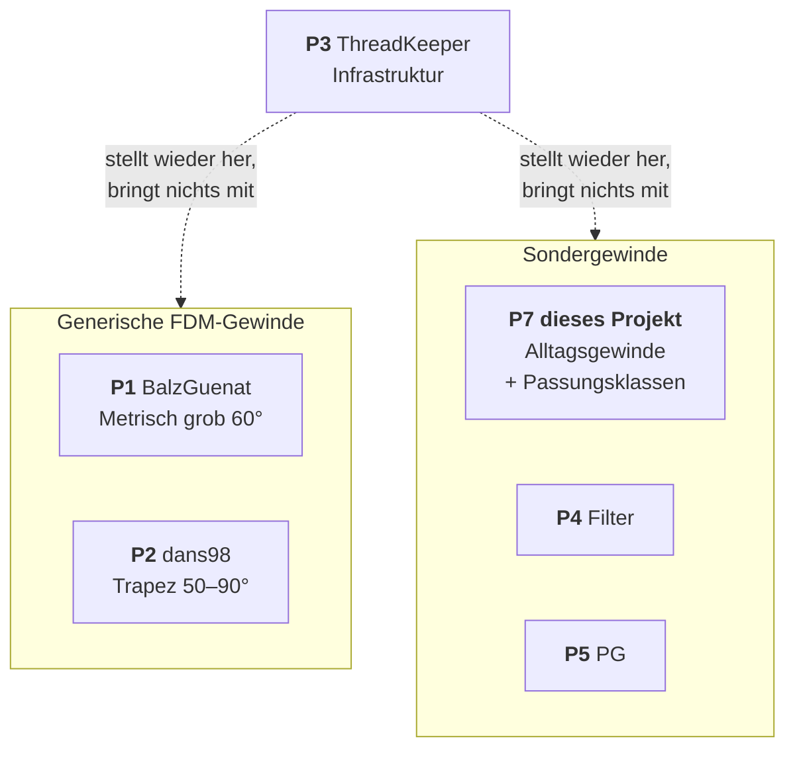

# Quellen und Erkenntnisse

**Das eine Dokument, auf das alles andere verweist.** Jede Behauptung im Repo, die aus einer
fremden Quelle stammt, hat hier einen Anker. Wer wissen will *woher wissen wir das* oder
*warum machen wir das so*, landet hier.

**Stand:** 25.07.2026

---

## Wie man das hier benutzt

Jeder Eintrag hat eine **stabile Kennung**. Andere Dokumente verlinken darauf, nicht auf
Überschriften:

| Kennung | Bedeutung | Beispiel-Link |
|---|---|---|
| `P1`–`P7` | Projekte | `docs/QUELLEN.md#p1` |
| `W1`–`W4` | Werkzeuge | `docs/QUELLEN.md#w1` |
| `N1`–`N6` | Normen und Referenzen | `docs/QUELLEN.md#n1` |
| `Q1`–`Q9` | Einzelfundstellen | `docs/QUELLEN.md#q1` |
| **`F1`–`F7`** | **Fehlermuster — die eigentliche Ausbeute** | `docs/QUELLEN.md#f1` |

**Prüfstand.** Nicht alles ist gleich gut belegt:

| | |
|:-:|---|
| ✅ | Am 25.07.2026 selbst geprüft — API abgefragt, Datei gelesen, Inhalt abgerufen |
| 📋 | Übernommen, **nicht selbst nachgeprüft** |
| ⚠️ | Fraglich oder bekannt veraltet |

[Verfassung § 1](spec/00-verfassung.md) verlangt Quellen für Zahlen in Gewindedateien. Diese
Regel gilt auch für Aussagen über andere Projekte.

---

# Teil A — Projekte

| | Repo | ★ | Lizenz | Letzter Push | |
|---|---|--:|---|---|:-:|
| **P1** | [BalzGuenat/CustomThreads](https://github.com/BalzGuenat/CustomThreads) | 395 | MIT | 2024-09 | ✅ |
| **P2** | [dans98/Fusion-360-FDM-threads](https://github.com/dans98/Fusion-360-FDM-threads) | 282 | BSD-3 | 2026-07 | ✅ |
| **P3** | [thomasa88/ThreadKeeper](https://github.com/thomasa88/ThreadKeeper) | 90 | MIT | 2025-02 | ✅ |
| **P4** | [toddmunro/Fusion-360-Lens-Filter-Threads](https://github.com/toddmunro/Fusion-360-Lens-Filter-Threads) | 66 | **keine** | 2020-05 | ✅ |
| **P5** | [grumpytechie/Fusion360ThreadDefinitions](https://github.com/grumpytechie/Fusion360ThreadDefinitions) | 22 | GPL-3.0 | 2026-04 | ✅ |
| **P6** | [matthewmcneill/FusionThreadsGenerator](https://github.com/matthewmcneill/FusionThreadsGenerator) | 4 | GPL-3.0 | 2026-06 | ✅ |
| **P7** | [grapefruit89/Fusion360-CustomThread](https://github.com/grapefruit89/Fusion360-CustomThread) | — | MIT + CC BY | — | dieses Projekt |

### Lizenzlage — vor jeder Übernahme prüfen

> [!IMPORTANT]
> [Verfassung § 8](spec/00-verfassung.md): kein GPL-Code, kein Code ohne Lizenz.
>
> **Übernehmbar** (mit Copyright-Header und Nennung): P1, P2, P3.
> **Nicht übernehmbar:** P5 und P6 (GPL-3.0, unvereinbar mit MIT), P4 (**keine Lizenz** →
> volles Urheberrecht).
>
> Gewindemaße selbst sind keine geschützten Werke — eine Maßangabe ist eine Tatsache.
> Geschützt ist die konkrete Datei samt Auswahl und Anordnung. Wer Maße aus einer Norm
> nachvollzieht, ist frei. Wer eine XML kopiert, nicht.

### P1 · BalzGuenat/CustomThreads

✅ README gelesen. Ø 8–50 mm, Steigung nur 3,5 und 5,0 mm, durchgehend 60°. Python-Generator
mit Konstanten am Dateikopf.

**Toleranzmodell `O.0`–`O.8`** verschiebt Major-, Minor- und Flankendurchmesser gemeinsam —
exakt unser Ansatz: *eine Klasse verschiebt das Profil, sie verformt es nicht*.
`O.0` ist „loosely based on ISO M30x3.5 6g/6H", dieselbe Bezugsgröße wie bei uns.
→ [ADR-0002](spec/adr/0002-sechs-toleranzklassen.md)

Issues → [F2](#f2), [F1](#f1), [F5](#f5), [F7](#f7)

### P2 · dans98/Fusion-360-FDM-threads

✅ README gelesen. Trapezprofile mit Kopf- und Fußfase von je **¼ der Steigung**,
Flankenwinkel **50, 60, 70, 80, 90°**. Klassen `0.###e` / `0.###i`.

Zwei Erkenntnisse, die dieses Projekt verändert haben: → [Q8](#q8), [Q9](#q9)

### P3 · thomasa88/ThreadKeeper

✅ Stellt Gewinde-XML nach jedem Fusion-Update wieder her, bringt **selbst keine Gewinde**
mit. Faktischer Standard — P1 und P2 verweisen beide darauf.

Warum wir es nicht nachbauen: [ADR-0003](spec/adr/0003-threadkeeper-statt-eigenem-keeper.md).
Was wir aus seinen Fehlern gelernt haben: [ADR-0009](spec/adr/0009-dateioperationen.md).

Offene Issues ✅: #8 und #14 (macOS-Installation), #9 (Kopierbefehl), #10 und #13 (Abstürze),
#11 (keine Gewinde mehr). → [F1](#f1), [F3](#f3), [F4](#f4), [F6](#f6)

> [!TIP]
> Die Fassung im **Autodesk App Store hinkt Wochen hinterher**. Anfang 2025 war sie über
> einen Monat defekt, während GitHub den Fix hatte. Bei Problemen zuerst die
> [GitHub-Release](https://github.com/thomasa88/ThreadKeeper/releases) — dafür muss die
> App-Store-Version deinstalliert werden. → [Q3](#q3)

### P4–P6 · die kleineren

**P4 toddmunro** — Filtergewinde M37–M82, 2020. 📋 Toleranzen unklar. Keine Lizenz ✅ →
nichts übernehmen. Als **Bedarfsnachweis** wertvoll: Filtergewinde werden nachgefragt.

**P5 grumpytechie** — PG-Kabelverschraubungen. GPL-3.0 ✅ → nicht übernehmbar. Zugehöriger
[Blogpost von 2017](https://grumpytechie.net/2017/11/05/custom-thread-definitions-in-autodesk-fusion-360-pg-conduit-threads/) 📋.

**P6 matthewmcneill** — React-Web-App für BSW, BSF, BA, ME, BSB, BSC. 📋 mit
Werkstatt-Inventar und Live-Vorschau. GPL-3.0 ✅ → nicht übernehmbar, aber als **Vorbild für
Bedienung** interessant → [ADR-0008](spec/adr/0008-web-rechner.md).

### Einordnung

Die großen Repos decken *„irgendein grobes metrisches Gewinde"* ab. Dieses Projekt deckt
*„**dieses konkrete** Alltagsgewinde, und es soll im FDM funktionieren"* ab. Komplementär,
nicht konkurrierend → [Verfassung § 9](spec/00-verfassung.md).

---

# Teil B — Werkzeuge

| | Werkzeug | Art | |
|---|---|---|:-:|
| **W1** | [ThreadKeeper](https://github.com/thomasa88/ThreadKeeper) | Fusion-Add-in, Wiederherstellung | ✅ |
| **W2** | Marcus Wakefield — Custom Thread Utility | Desktop, XML ↔ CSV, Offset | 📋 |
| **W3** | Generatoren in P1, P2, P6 | Python bzw. React | ✅ |
| **W4** | [`tools/build_thread.py`](../tools/build_thread.py) | Rezept → XML | dieses Projekt |

### W2 · Marcus Wakefield Utility

📋 **Nicht selbst geprüft.** Aus der Zusammenstellung: Desktop-Anwendung für Windows und
macOS, konvertiert Fusion-XML nach CSV und zurück, kann Durchmesser global versetzen.
Vertrieb über [Ko-fi](https://ko-fi.com/marcuswakefield) 📋, kein öffentliches Repository.
[Vorstellung im Autodesk-Forum](https://forums.autodesk.com/t5/fusion-design-validate-document/fusion-360-custom-thread-utility/td-p/11722781) 📋

**Warum das zählt:** Funktional das nächste Gegenstück zu W4 — und **nicht quelloffen**.
Damit ist es der stärkste Beleg für die Lücke, die
[ADR-0008](spec/adr/0008-web-rechner.md) schließen soll.

> [!NOTE]
> Vor einer Erwähnung in der README sollte jemand es tatsächlich ausprobiert haben.

### W3 · Generatoren im Vergleich

| Werkzeug | Parameter liegen | Prüfbar? |
|---|---|---|
| P1 `main.py` ✅ | als Konstanten im Skript | nein |
| P2 Generator ✅ | dito | nein |
| P6 Web-App ✅ | in der Oberfläche | — |
| **W4** (dieses Projekt) | in [`recipes/*.toml`](../recipes/), getrennt vom Code | **ja, in CI** |

Der Unterschied: Weil unsere Parameter eigene Dateien sind, kann die CI prüfen, ob die
ausgelieferten XML noch zu ihren Rezepten passen. Wer eine XML von Hand ändert, fällt auf.

📋 Ältere Werkzeuge: [C#-Trapezgenerator 2020](https://forums.autodesk.com/t5/fusion-design-validate-document/custom-threads-xml-generator/td-p/9594220),
[Bambu-Lab-Generator 2025](https://forum.bambulab.com/t/true-3d-printable-thread-generator-for-fusion360/194518).

---

# Teil C — Normen und Referenzen

| | Was | |
|---|---|:-:|
| **N1** | [Autodesk: Custom threads in Fusion](https://www.autodesk.com/support/technical/article/caas/sfdcarticles/sfdcarticles/Custom-Threads-in-Fusion-360.html) | ✅ |
| **N2** | Fusions 18 mitgelieferte Gewindedateien | ✅ |
| **N3** | ISO 965-1 — metrische Gewindetoleranzen | ✅ |
| **N4** | DIN 103 — Trapezgewinde | ✅ |
| **N5** | ISO 228 (G-Serie), DIN 477 (Gasflaschen), ISBT (PET) | 📋 |
| **N6** | Online-Rechner und Maßtabellen | 📋 |

### N1 · Der Autodesk-Artikel

✅ Die Quelle, auf die sich P1, P2 und P3 alle berufen. Beschreibt das Ablegen der XML im
`ThreadData`-Ordner.

**Technisch dünn:** kein Schema, keine Feldbeschreibung, kein Wort zur Validierung — und
keines dazu, dass eine fehlerhafte Datei die gesamte Gewindeliste unbrauchbar machen kann
([F1](#f1)). Thomas Axelsson schrieb im Februar 2025, der Artikel sei „not yet updated, but
close enough" ✅; die macOS-Pfade darin waren veraltet.

Deshalb ist [`profilgeometrie.de.md`](profilgeometrie.de.md) kein Doppel der offiziellen
Doku, sondern schließt eine Lücke.

### N2 · Fusions eigene Dateien

✅ Selbst durchgesehen, 18 Dateien, **fünf Flankenwinkel**:

| Winkel | Dateien |
|---:|---|
| 60° | ISO Metric, ANSI Metric M, ANSI Unified, GB Metric, Inch Tapping, Metric Forming, AFBMA Locknuts, DIN Wood Screw, GOST Self-tapping |
| 55° | ISO / BSP / DIN / JIS / GB Pipe Threads |
| 45° | Inch Tapping Threads **for Plastics** |
| 30° | ISO Metric Trapezoidal, Metric Tapping Threads **for Plastics** |
| 29° | ACME Screw Threads |

**Zwei Befunde:**

1. Die einzigen beiden „for Plastics"-Dateien nutzen **45° und 30°** — Autodesk weicht für
   Kunststoff selbst vom 60°-Standard ab. Stärkstes Argument für unser 45°-FDM-Profil.
2. **`SortOrder` 1–63 ist belegt** (ANSI Unified = 1, ANSI Metric = 2, ISO Metric = 3,
   ISO Trapezoidal = 4 …). Deshalb beginnen unsere bei **201**.

### N3–N4 · Formeln, die wir verwenden

✅ In [`build_thread.py`](../tools/build_thread.py) und nachgerechnet in
[`profilgeometrie.de.md`](profilgeometrie.de.md):

- Profilhöhe `H = P / (2 · tan(A/2))`
- Fasen → Durchmesser: `a = (P/2 − c) / tan(A/2)`
- ISO metrisch: Kopffase `P/8`, Fußfase `P/4` → ergibt exakt `d₂ = d − 0,64952·P`
- Whitworth: `P/6` oben und unten → ergibt exakt `0,640327·P`
- ISO-Trapez (DIN 103): `0,366·P` oben und unten
- ISO 965 M20×2,5 in 6g: Grundabmaß `es = −0,042 mm` ✅ (per Websuche bestätigt)

### N6 · Rechner

📋 Alle nicht selbst geprüft:
[amesweb.info](https://amesweb.info/Screws/metric-thread-dimensions-calculator.aspx) ·
[theoreticalmachinist.com](https://theoreticalmachinist.com/Threads-MetricMProfile.aspx) ·
[machiningdoctor.com](https://www.machiningdoctor.com/) ·
[ring-plug-thread-gages.com (G-Serie)](https://www.ring-plug-thread-gages.com/PDChart/G-series-Fine-thread-data.html) ·
[ISBT Threadspecs](https://www.isbt.com/resources/isbt-threadspecs)

> [!WARNING]
> Diese Rechner liefern Werte für **Metallfertigung**. Gute Ausgangspunkte für Nennmaße,
> aber ihre Toleranzen sind für FDM unbrauchbar — dafür gibt es unsere Klassen.

---

# Teil D — Einzelfundstellen

| | Fundstelle | Was daraus wurde | |
|---|---|---|:-:|
| **Q1** | [drucktipps3d — Erhebung entlang Pfad verdreht Profil](https://forum.drucktipps3d.de/forum/thread/45313-erhebung-entlang-pfad-verdreht-profil/) | [ADR-0001](spec/adr/0001-xml-statt-sweep.md) — der Grund für dieses Projekt | 📋 |
| **Q2** | [ThreadKeeper #7 — macOS-Pfad](https://github.com/thomasa88/ThreadKeeper/issues/7) | [F3](#f3) | ✅ |
| **Q3** | [App-Store-Bewertung 02.02.2025](https://apps.autodesk.com/FUSION/en/Detail/Index?id=1725038115223093226) | [F3](#f3), App-Store-Verzug | 📋 |
| **Q4** | [ThreadKeeper #9 — Robustness of copy command](https://github.com/thomasa88/ThreadKeeper/issues/9) | [F4](#f4) | ✅ |
| **Q5** | [ThreadKeeper #11 — no threads at all](https://github.com/thomasa88/ThreadKeeper/issues/11) | [F1](#f1) | ✅ |
| **Q6** | [BalzGuenat #16 — Misleading tolerance descriptions](https://github.com/BalzGuenat/CustomThreads/issues/16) | [F2](#f2) — der wichtigste Fund | ✅ |
| **Q7** | [BalzGuenat #2 — PitchDia < MinorDia](https://github.com/BalzGuenat/CustomThreads/issues/2) | [F1](#f1), [F7](#f7), Praxiswerte | ✅ |
| **Q8** | [P2 README — 50/60/70/80/90°](https://github.com/dans98/Fusion-360-FDM-threads) | Fusion akzeptiert mehr als fünf Winkel | ✅ |
| **Q9** | [P2 README — Überhangregel](https://github.com/dans98/Fusion-360-FDM-threads) | `Überhang = 90° − A/2` | ✅ |

### Q8 · Fusion akzeptiert mehr als fünf Flankenwinkel

P2 liefert seit Jahren Profile mit **70°, 80° und 90°**. Die fünf Winkel aus [N2](#n2) sind
also keine Grenze des Generators, nur das, was Autodesk mitliefert.

**Das korrigierte eine falsche Aussage in unserem eigenen KI-Prompt** („Andere Winkel gibt es
nicht"). Der Validator meldet unbekannte Winkel weiterhin als **Warnung**, nicht als Fehler —
das war zufällig schon richtig. Und es macht PG-Gewinde mit 80° möglich.

### Q9 · Die Überhangregel

> „the overhang angle of a thread printed in the vertical orientation is
> 90 − (threadAngle/2) degrees"

Bei 60° also 60° Überhang, bei 45° schon 67,5°. Die knappste Erklärung dafür, warum flachere
Flanken besser drucken. → [`profilgeometrie.de.md`](profilgeometrie.de.md)

### Praxiswerte aus dem Feld

Was tatsächlich an Spiel nötig ist, lässt sich nicht ausrechnen, nur sammeln
→ [Toleranz-Sammelstelle](../../discussions/1).

| Quelle | Drucker | Gewinde | Wert | |
|---|---|---|---|:-:|
| [Q7](#q7) | Ender 3, Serienzustand | Filter M39–M80, 0,75 mm Steigung | **0,2 mm innen / 0,1 mm außen** | ✅ |

> Auffällig: **asymmetrisch**, mehr auf dem Innengewinde. Passt dazu, dass Bohrungen im
> FDM-Druck zu eng geraten und Außenmaße zu groß. Bestätigt sich das in weiteren Berichten,
> wäre es ein Argument, die Aufteilung bei „beide gedruckt" nicht exakt hälftig zu machen.

📋 Weitere, nicht geprüft:
[Autodesk — doesn't load custom threads](https://forums.autodesk.com/t5/fusion-support-forum/fusion360-doesn-t-load-custom-threads/td-p/9963329) ·
[Bambu Lab — thread definition](https://forum.bambulab.com/t/3d-printing-thread-definition-for-fusion-thread-tool/107715) ·
[Reddit r/functionalprint](https://www.reddit.com/r/functionalprint/comments/jii9e8/i_created_3dprintfriendly_thread_types_for_fusion/) ·
[Stargazers Lounge — Astro-threads](https://stargazerslounge.com/topic/346425-astro-threads-for-fusion-360/) ·
[Gist — DIN 7756 Vg8](https://gist.github.com/oliverhanka/3197f1782617faf48610397da4ce2311)

---

# Teil E — Fehlermuster

**Die eigentliche Ausbeute.** Was in allen Projekten wiederkehrt, mit Beleg und unserer
Gegenmaßnahme. Fehler, die andere schon gemacht haben, muss man nicht wiederholen.

## F1 · Eine kaputte XML nimmt die ganze Gewindeliste mit

**Symptom** Nach dem Einspielen zeigt Fusion **gar keine** Gewinde mehr, auch keine
Standardgewinde.

**Beleg** [Q5](#q5) ✅ · [ThreadKeeper #1](https://github.com/thomasa88/ThreadKeeper/issues/1) ✅ ·
[BalzGuenat #12](https://github.com/BalzGuenat/CustomThreads/issues/12) ✅ (Absturz beim
Öffnen des Werkzeugs)

**Ursachen** Syntaxfehler, doppelter `<Name>`, leere Datei nach fehlgeschlagenem Kopieren
([F4](#f4)).

**Unsere Gegenmaßnahme**

- [`validate_threads.py`](../tools/validate_threads.py) prüft Wohlgeformtheit, eindeutige
  `<Name>`, `SortOrder` und Geometrie, **bevor** eine Datei irgendwo landet
- [ADR-0004](spec/adr/0004-kein-autofix.md) — kein automatisches Umschreiben
- [ADR-0009](spec/adr/0009-dateioperationen.md) — nach dem Kopieren Prüfsumme vergleichen
- Issue-Vorlage nennt dieses Symptom als **erste** Verdachtsdiagnose

## F2 · Die Beschriftung der Toleranzklasse lügt

**Symptom** Die Klasse heißt „0.15 mm", das tatsächliche Spiel ist ein Vielfaches.

**Beleg** [Q6](#q6) ✅ — seit März 2026 offen:

> „The README states that `O.0 has the tightest tolerances which are loosely based on
> ISO M30x3.5 6g/6H` … but it appears to have been changed in the later versions such that
> O.0 means that there is absolutely _no_ tolerance whatsoever."

**Und in diesem Projekt selbst**, bis v1.0.0: `0.15mm (Tight)` gab real 0,45 mm.

Zwei unabhängige Projekte, derselbe Fehler, jahrelang unbemerkt. Keine Nachlässigkeit,
sondern eine strukturelle Schwäche: **Niemand rechnet Beschriftungen nach.**

**Unsere Gegenmaßnahme**

- Der Validator liest die Zahl aus `<Class>` und vergleicht sie mit der tatsächlichen
  Differenz `internal − external`. Als **Fehler**, nicht als Warnung.
- [ADR-0002](spec/adr/0002-sechs-toleranzklassen.md) — Klassennamen nennen den Anwendungsfall
- `0.00 mm (Exact)` gestrichen: ausgerechnet die „genaueste" Klasse ist die, die nicht
  funktioniert. Dasselbe gilt für `O.0` bei [P1](#p1).

## F3 · Fest verdrahtete Pfade brechen

**Symptom** Nach einem Fusion-Update erscheint beim Start ein Python-Traceback.

**Beleg** [Q2](#q2) ✅, [Q3](#q3) 📋 — Autodesk benennt das macOS-Bundle mal
`Autodesk Fusion.app`, mal `Autodesk Fusion 360.app`. Der erste Fix hardcodierte den neuen
Namen und brach bei allen mit dem alten:

> „I'm on v1.2.2 of this plugin and I'm having this same issue because my app _does_ have
> the `360` suffix."

**Es gibt keinen korrekten festen Namen.** Beide existieren gleichzeitig im Feld.

**Unsere Gegenmaßnahme** [ADR-0009](spec/adr/0009-dateioperationen.md) — Pfade werden
**gesucht statt geraten**, per Glob über `production` *und* `pre-production`, ohne
`.app`-Namen im Quelltext.

## F4 · Kopieren über die Shell erzeugt stille Fehler

**Symptom** Die Datei ist da, aber leer. Keine Fehlermeldung.

**Beleg** [Q4](#q4) ✅ — `subprocess.check_call(f'copy "{src}" "{dst}"', shell=True)` erzeugte
ein leeres Dokument:

> „apparently in this configuration it only copied a blank document"

Der Vorschlag, auf `shutil.copy` umzustellen, ist seit über einem Jahr offen. Eine leere XML
ist der schlimmstmögliche Ausgang: Sie löst [F1](#f1) aus, ohne dass irgendwo ein Fehler
gemeldet wurde.

**Unsere Gegenmaßnahme** [ADR-0009](spec/adr/0009-dateioperationen.md) — nur `shutil.copy2`,
nie `subprocess`, und nach jedem Kopieren Größe und Prüfsumme vergleichen.

## F5 · „Thread size is bigger than the body"

**Symptom** Fusion verweigert das Gewinde mit dieser Meldung.

**Beleg** [BalzGuenat #9](https://github.com/BalzGuenat/CustomThreads/issues/9) ✅

**Ursache** Kein Fehler der Datei. Grobe Steigung → tiefes Gewinde → Kerndurchmesser sprengt
die Wandstärke. Betrifft uns bis TR150×16: bei 16 mm Steigung sind das 8 mm Gewindetiefe.

**Unsere Gegenmaßnahme** ❌ **offen** — gehört in ein Troubleshooting-Kapitel.

## F6 · macOS ist überall die schwächere Seite

**Beleg** ThreadKeeper #7, #8, #14 ✅ — Installation und Pfade. Dazu unser eigener
`find-threaddata.bat`, den es für macOS schlicht nicht gibt.

**Unsere Gegenmaßnahme** ❌ **offen** — `find-threaddata.sh` steht auf der Liste
([Ü-4](spec/03-review-2026-07.md)).

## F7 · „Außerhalb des Anwendungsfalls" ist kein Ersatz für „korrekt"

**Beleg** [Q7](#q7) ✅ — Ein Nutzer meldete `PitchDia < MinorDia`, also geometrisch unmögliche
Werte. Der Maintainer wies das zunächst zurück, weil so feine Steigungen nicht zum Zweck des
Projekts passten. Der Fehler war trotzdem real und wurde später per PR behoben — der Melder
druckte die feinen Gewinde nämlich sehr wohl, auf einem Ender 3, mit Erfolg.

**Unsere Gegenmaßnahme** ❌ **offen** — gehört als Regel in
[CONTRIBUTING.md](../CONTRIBUTING.md): Wenn jemand einen Rechenfehler meldet, ist die Frage
*„ist die Rechnung richtig?"* — nicht *„gehört der Anwendungsfall zu uns?"*. Der Zuschnitt
steht in der [Spezifikation](spec/01-spezifikation.md); er ist ein Argument über **Aufnahme**,
nicht über **Korrektheit**.

---

## Übersicht: Muster → Gegenmaßnahme

| | Fehlermuster | Umgesetzt in | Status |
|:-:|---|---|:-:|
| [F1](#f1) | Kaputte XML killt Gewindeliste | Validator · ADR-0004 · ADR-0009 | ✅ |
| [F2](#f2) | Beschriftung lügt | Validator-Prüfung `<Class>` ↔ Spiel | ✅ |
| [F3](#f3) | Fest verdrahtete Pfade | ADR-0009 | 📝 geplant |
| [F4](#f4) | Shell-Kopieren | ADR-0009 | 📝 geplant |
| [F5](#f5) | Wandstärke zu dünn | Troubleshooting | ❌ offen |
| [F6](#f6) | macOS schwächer | `find-threaddata.sh` | ❌ offen |
| [F7](#f7) | Scope statt Korrektheit | CONTRIBUTING | ❌ offen |

## Was der Landschaft fehlt

- **Ein offenes Gegenstück zu [W2](#w2)** — XML lesen, Maße versetzen, ausgeben.
  [`build_thread.py`](../tools/build_thread.py) kann das bereits, aber ohne Oberfläche
  → [ADR-0008](spec/adr/0008-web-rechner.md)
- **Bessere macOS-Unterstützung** → [F6](#f6)
- **Mehr geprüfte Sondergewinde** — G¼–G½, M42×1, PCO 1810
  → [Aufnahmeliste](spec/01-spezifikation.md#6-aufnahmekriterien-für-neue-gewinde)
