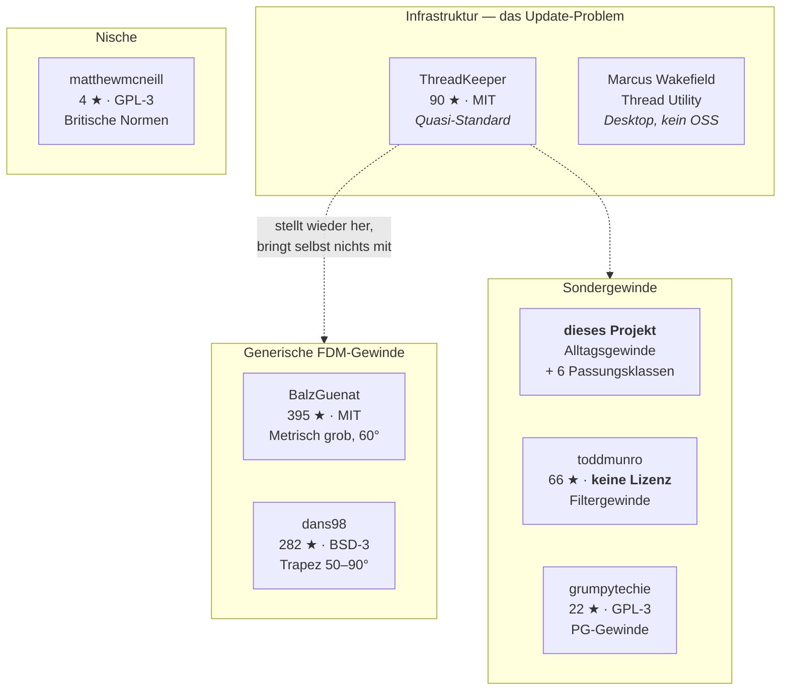

# Quellen

Alles, worauf sich dieses Projekt stützt — Projekte, Werkzeuge, Normen, Fundstellen. Damit
niemand dieselbe Recherche zweimal machen muss und jede Behauptung im Repo nachprüfbar ist.

**Stand:** 25.07.2026

---

## Die Dokumente

| | Inhalt |
|---|---|
| [01 — Projekte](01-projekte.md) | Die Repositories im Umfeld: Sterne, Lizenzen, Fokus, was man dort lernen kann |
| [02 — Werkzeuge](02-werkzeuge.md) | Add-ins und Generatoren, auch die außerhalb von GitHub |
| [03 — Referenzen](03-referenzen.md) | Offizielle Doku, Normen, Maßtabellen, Rechner |
| [04 — Fundstellen](04-fundstellen.md) | Foren, Diskussionen, Einzelbeiträge |
| [05 — Fehlermuster](05-fehlermuster.md) | Was in allen Projekten immer wieder schiefgeht — und was wir daraus gebaut haben |

---

## Prüfstand

Nicht alles hier ist gleich gut belegt. Jeder Eintrag trägt eine Kennzeichnung:

| Marke | Bedeutung |
|:-:|---|
| ✅ | Am 25.07.2026 selbst geprüft — GitHub-API abgefragt, Datei gelesen oder Inhalt abgerufen |
| 📋 | Aus einer Zusammenstellung übernommen, **nicht selbst nachgeprüft** |
| ⚠️ | Angabe erscheint fraglich oder ist bekannt veraltet |

Das ist keine Förmelei: Verfassung § 1 verlangt Quellen für Zahlen, die in Gewindedateien
landen. Diese Regel gilt auch für Aussagen über andere Projekte.

---

## Die Landschaft in einem Bild

**Einordnung:** Die großen Repos decken *„irgendein grobes metrisches Gewinde"* ab. Dieses
Projekt deckt *„**dieses konkrete** Alltagsgewinde, und es soll im FDM funktionieren"* ab.
Komplementär, nicht konkurrierend — das begründet
[Verfassung § 9](../spec/00-verfassung.md).

---

## Lizenzlage — vor jeder Übernahme prüfen

> [!IMPORTANT]
> [Verfassung § 8](../spec/00-verfassung.md): kein GPL-Code, kein Code ohne Lizenz.

| Projekt | Lizenz | Übernahme in dieses Projekt |
|---|---|---|
| ThreadKeeper | MIT ✅ | erlaubt, mit Copyright-Header und `NOTICE` |
| BalzGuenat/CustomThreads | MIT ✅ | erlaubt, mit Nennung |
| dans98/Fusion-360-FDM-threads | BSD-3-Clause ✅ | erlaubt, mit Nennung |
| grumpytechie/Fusion360ThreadDefinitions | GPL-3.0 ✅ | **nein** — unvereinbar mit MIT. Verlinken ja, kopieren nein. |
| matthewmcneill/FusionThreadsGenerator | GPL-3.0 ✅ | **nein** — dito |
| toddmunro/Fusion-360-Lens-Filter-Threads | **keine** ✅ | **nein** — ohne Lizenz gilt volles Urheberrecht |

Gewindemaße selbst sind übrigens **keine** urheberrechtlich geschützten Werke — eine
Maßangabe ist eine Tatsache. Geschützt ist die konkrete Datei samt Auswahl und Anordnung.
Wer Maße aus einer Norm oder Messung nachvollzieht, ist frei. Wer eine XML kopiert, nicht.

---

## Was noch fehlt

Strategische Lücken in der Landschaft, an denen dieses Projekt ansetzen könnte:

- **Ein offenes Gegenstück zu Marcus Wakefields Utility** — XML lesen, Maße offsetten,
  wieder ausgeben. Genau das macht [`tools/build_thread.py`](../../tools/build_thread.py)
  bereits, allerdings ohne Oberfläche → [ADR-0008](../spec/adr/0008-web-rechner.md).
- **Bessere macOS-Unterstützung.** Schwachstelle bei ThreadKeeper *und* bei allen
  Pfadfindern, unserem eingeschlossen.
- **Mehr hochwertige Sondergewinde** — G¼–G½, M42×1, PCO 1810.
  → [Aufnahmeliste](../spec/01-spezifikation.md#6-aufnahmekriterien-für-neue-gewinde)
