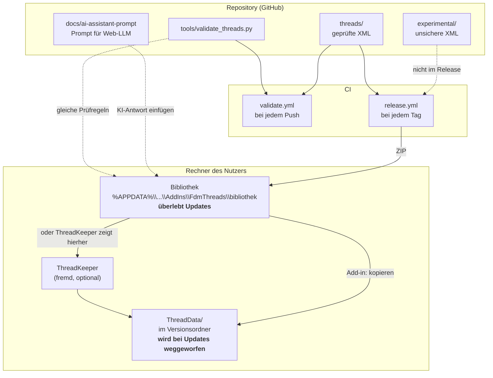

# Technischer Plan

> **Wie** die Anforderungen aus der [Spezifikation](01-spezifikation.md) umgesetzt werden —
> und mit welchen Mitteln ausdrücklich **nicht**.

**Version 1.0 · Stand 25.07.2026**

---

## 1. Erlaubter Technologie-Stack

| Zweck | Erlaubt | Begründung |
|-------|---------|------------|
| Gewindedaten | **XML** nach Fusions `ThreadType`-Schema | Von Fusion vorgegeben |
| Werkzeuge für Mitwirkende | **Python 3.12+, nur Standardbibliothek** | Läuft überall, keine Installation, `xml.etree` reicht |
| Endnutzer-Werkzeug Windows | **`.bat` als Starter + PowerShell für die Logik** | PowerShell ist seit Windows 7 dabei, bleibt lesbar |
| Endnutzer-Werkzeug macOS | **`.sh` (bash/zsh)** | Vorinstalliert |
| Add-in *(v2)* | **Python, Fusions eigener Interpreter, nur Standardbibliothek** | Kein Build, kein Compiler, kein Paketmanager |
| CI | **GitHub Actions**, `ubuntu-latest`, Python + `gh` | Bereits vorhanden, kostenlos |
| Doku | **Markdown**, zweisprachig | — |

## 2. Verbotener Stack

| Verboten | Warum |
|----------|-------|
| **PyInstaller, Nuitka, cx_Freeze, jedes `.exe`** | Verfassung § 3. 30–80 MB, SmartScreen ohne Zertifikat (200–400 €/Jahr), notorische AV-Fehlalarme durch den Entpackmechanismus |
| **Python-Abhängigkeiten aus PyPI** in Endnutzer-Werkzeugen | Fusions Interpreter ist nicht unser Interpreter. `pip install` im Add-in-Kontext ist eine Fehlerquelle ohne Gegenwert |
| **lxml, numpy, pandas** | `xml.etree` und `decimal` reichen. Jede Abhängigkeit ist eine Installationshürde |
| **Node, npm, Webframeworks** | Nichts hier braucht einen Build-Schritt |
| **GPL-lizenzierter Fremdcode** | Verfassung § 8, unvereinbar mit MIT |
| **Fremdcode ohne Lizenz** | Ohne Lizenz gilt volles Urheberrecht |
| **Datenbanken jeder Art** | Der Datenbestand sind neun Textdateien |

## 3. Architektur



**Kernidee:** Die **Bibliothek** liegt in `%APPDATA%\Autodesk\Autodesk Fusion 360\API\AddIns\`
— dieser Pfad ist versionsunabhängig und überlebt Fusion-Updates. Der `ThreadData`-Ordner
ist nur noch ein **Ziel zum Hinkopieren**, kein Aufbewahrungsort.

## 4. Datenmodell

Ein `ThreadType` enthält **keine Form**, nur Zahlen. Fusion zeichnet daraus immer ein
symmetrisches, oben und unten gekapptes V.

Verbindlich für alle Dateien dieses Projekts:

| Regel | Wert |
|-------|------|
| Nennmaß | `<Size>` = Nenn-Außendurchmesser |
| Profilform | über alle Klassen **identisch** — eine Klasse verschiebt, sie verformt nicht |
| Abstände | `a = MajorDia − PitchDia` und `b = PitchDia − MinorDia` sind je Größe konstant |
| Klasse | verschiebt das Profil um ±δ: innen `+δ`, außen `−δ` |
| `TapDrill` | exakt `MinorDia`, nur bei `internal` |
| `SortOrder` | 201 … 299 für `threads/`, 300+ für `experimental/` |
| Rundung | 3 Nachkommastellen, `Decimal`, keine Floats bei der Erzeugung |

Die sechs Klassen und ihre δ stehen in [ADR-0002](adr/0002-sechs-toleranzklassen.md).

## 5. Komponenten

### 5.1 `tools/validate_threads.py` — der Doctor

Kein Generator, sondern ein **strenger Reviewer**. Drei Prüfebenen:

**A · Strukturell** *(hart)* — wohlgeformtes XML, `<ThreadType>` als Wurzel, Pflichtfelder,
`<Name>` und `<SortOrder>` projektweit eindeutig, `SortOrder` ≥ 200, beide Gender je Klasse,
`MajorDia > PitchDia > MinorDia`, `TapDrill` = `MinorDia`, keine `.txt` im Ordner.

**B · Geometrisch** *(hart bei Unmöglichkeit, sonst weich)* — Plausibilitätsgrenzen für
Winkel, Durchmesser, Steigung, Gewindetiefe/Steigung und Spiel. **Spiel gegen
Klassenbeschriftung**: die Zahl im `<Class>`-Text muss zur tatsächlichen Differenz passen.

**C · Praxis** *(weich)* — Steigung unter 1,5 mm, `CustomName` ohne `[3D-Print]`, unbekannter
Flankenwinkel.

**Ausdrücklich nicht:** kein `--fix`, kein automatisches Umschreiben → [ADR-0004](adr/0004-kein-autofix.md).

### 5.2 `tools/find-threaddata.bat` / `.sh` — Notnagel

Findet den ThreadData-Ordner der laufenden Fusion-Instanz. Bleibt erhalten für den Fall, dass
Fusion wegen einer kaputten XML nicht mehr startet — dann braucht man ein Werkzeug
**außerhalb** von Fusion.

Kaskade: laufender Prozess → Startmenü-Verknüpfung → `webdeploy\production` nach Datum.

### 5.3 Add-in `FdmThreads` *(v2, geplant)*

```
API\AddIns\FdmThreads\
├── FdmThreads.manifest     JSON, ~15 Zeilen
├── FdmThreads.py           Einstieg, Menü
├── lib/validate.py         geteilte Prüflogik mit tools/
├── bibliothek/             die XMLs, überleben Updates
└── resources/              Icons
```

Menü unter `UTILITIES → FDM THREADS`:

| Befehl | Verhalten |
|--------|-----------|
| Gewinde wiederherstellen | Bibliothek → aktueller ThreadData-Ordner, mit Backup |
| Neues Gewinde einfügen… | Textfeld, validieren, Vorschau, dann speichern |
| Prompt für KI kopieren | Nur-Lese-Textfeld zum Markieren + Link-Knopf |
| Bibliothek öffnen | Explorer/Finder |
| Status | Aktiver Pfad, installiert/fehlt, ThreadKeeper erkannt? |

**Beim Start:** still, solange nichts fehlt. Meldet sich nur, wenn tatsächlich Gewinde weg
sind — einmal, mit Neustart-Hinweis. Kein Autostart außerhalb von Fusion.

**Verhältnis zu ThreadKeeper:** siehe [ADR-0003](adr/0003-threadkeeper-statt-eigenem-keeper.md).
Kurz: erkennt ThreadKeeper und überlässt ihm dann das Wiederherstellen, statt parallel zu
synchronisieren.

## 6. Grenzen zur Laufzeit

| Grenze | Regel |
|--------|-------|
| Schreibzugriff | Nur `ThreadData/`, die eigene Bibliothek und Backups. Sonst nichts. |
| Netzwerk | Keiner ohne Nutzeraktion. Der Link-Knopf öffnet den Browser, mehr nicht. |
| Adminrechte | Nie nötig |
| Registry / Autostart / Scheduled Task | Nicht angefasst |
| Deinstallation | Ordner löschen genügt, keine Rückstände |
| Vor jedem Überschreiben | Backup nach `ThreadData/_backup_JJMMTT/` |

## 7. Fehlerfälle, die eingeplant sein müssen

| Fall | Verhalten |
|------|-----------|
| Fusion läuft nicht | `.bat` sucht trotzdem weiter (Kaskade), meldet den Fundweg |
| Mehrere `production`-Ordner | Alle patchen, nicht nur den neuesten — überlebt Rollbacks |
| Kaputte XML in der Bibliothek | Nicht kopieren, Datei benennen, Rest trotzdem einspielen |
| Fusion zeigt gar keine Gewinde mehr | In Doku und Issue-Vorlage als **erste** Verdachtsdiagnose |
| `<Name>` kollidiert mit Standardgewinde | Validator schlägt an, Import verweigert |
| ThreadKeeper und Add-in parallel | Erkennen, eines der beiden übernimmt, nie beide |

## 8. Prüfung des Plans

| Anforderung | Umgesetzt durch | Status |
|-------------|-----------------|:-:|
| FA-1 Bibliothek | `threads/`, 9 Dateien, 41 Größen | ✅ |
| FA-2 Installation | `find-threaddata.bat`, Release-ZIP | ✅ Windows / ⚠️ macOS nur Doku |
| FA-3 Eigene Gewinde | `docs/ai-assistant-prompt.de.md` | ✅ |
| FA-4 Prüfung | `tools/validate_threads.py` + CI | ✅ (FA-4.3 ergänzt) |
| FA-5 Update-Festigkeit | ThreadKeeper-Empfehlung | ⚠️ fremd, eigenes Add-in offen |
| FA-6 Import | Add-in v2 | ❌ offen |
