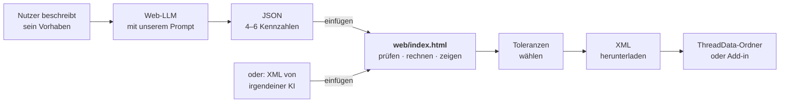
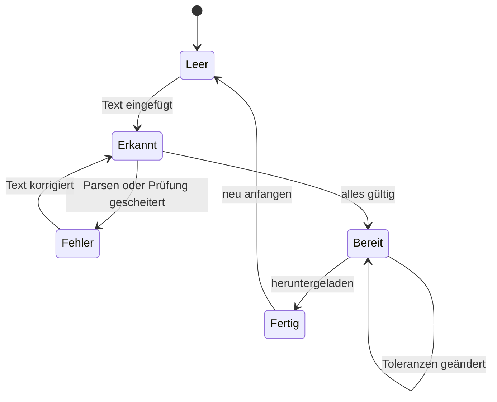

# Architektur: Web-Rechner

> Bauplan für `web/index.html`. Setzt [ADR-0008](adr/0008-web-rechner.md) um.
> Übergeordnet gelten [Verfassung](00-verfassung.md) und [Spezifikation](01-spezifikation.md).

**Version 0.1 · Entwurf · Stand 25.07.2026 · noch nichts gebaut**

---

## 1. Was das Ding tut

Eine **einzelne HTML-Datei**. Der Nutzer wirft rein, was er von einer KI bekommen hat —
egal in welchem Format — und bekommt eine geprüfte, fertig gerechnete Fusion-XML heraus.



**Kein Backend. Kein Login. Nichts wird hochgeladen.** Alles läuft im Browser — das ist
zugleich die ehrliche Antwort auf jede Datenschutzfrage: Es gibt keinen Server, der etwas
sehen könnte.

Zwei Betriebsarten, **derselbe Code**:

| | |
|---|---|
| **Offline** | Datei aus dem Release herunterladen, doppelklicken. Browser öffnet sie über `file://`. |
| **Online** | Dieselbe Datei über GitHub Pages, damit man sie verlinken kann. |

> Die Offline-Fähigkeit ist keine Kür. Sie ist der Grund, warum es keinen Build-Schritt und
> keine externen Abhängigkeiten geben darf — `file://` verbietet `fetch()` und ES-Module.

---

## 2. Das Übergabeformat

### Warum JSON und nicht XML

| | XML von der KI | **JSON-Rezept** |
|---|---|---|
| Was die KI liefern muss | ~40 gerechnete Zahlen | 4–6 recherchierte |
| Vom Nutzer prüfbar | nein | ja, mit Messschieber |
| In JS zu lesen | DOMParser, fehleranfällig | `JSON.parse`, eingebaut |
| Zuverlässigkeit der KI | mäßig | hoch — strukturierte Ausgabe ist trainiert |

XML als Eingabe bleibt trotzdem erlaubt, aber als **Reparaturfall**, nicht als Normalweg
(→ [§5, Modus C](#5-die-drei-eingabemodi)).

### Schema `thread-recipe/1`

```json
{
  "schema": "thread-recipe/1",
  "name": "PCO1881_PET_Deckel_3DPrint",
  "customName": "[3D-Print] PCO1881 - PET Flasche (Deckel)",
  "filename": "PCO1881_PET_Deckel.xml",
  "unit": "mm",
  "angle": 60,
  "sortOrder": 250,
  "profile": "iso-metric",
  "clearances": [0.10, 0.15, 0.20],
  "cases": ["real"],
  "sizes": [
    {
      "designation": "PCO 1881",
      "ctd": "PCO1881",
      "nominal": 28.0,
      "pitch": 2.7,
      "minor": null,
      "pitchDia": null,
      "crestFlat": null,
      "rootFlat": null
    }
  ],
  "meta": {
    "purpose": "Deckel für PET-Getränkeflasche",
    "counterpart": "real",
    "sources": ["ISBT Threadspecs PCO 1881"],
    "confidence": "high",
    "safetyNotes": ["Nicht für Flaschen unter Druck"]
  }
}
```

**Pflicht:** `schema`, `name`, `customName`, `angle`, `sortOrder`, `sizes[]` mit `designation`,
`nominal` und (`pitch` **oder** `tpi`).
**Alles andere optional.** `null` und Weglassen sind gleichbedeutend.

`meta` ist rein informativ und beeinflusst die Rechnung nicht — es transportiert, was das
Interview ergeben hat. Die Oberfläche zeigt es an, damit der Nutzer prüfen kann, ob die KI
ihn richtig verstanden hat. `confidence: "low"` färbt die Anzeige und blendet einen
Messhinweis ein.

> **`sortOrder` ≥ 200 ist Pflicht.** Autodesk belegt 1–63
> ([N2](../QUELLEN.md#n2)). Der Rechner setzt niedrigere Werte **nicht** still hoch, sondern
> weist sie ab (Verfassung § 7) und zeigt den Grund.

### Dieselben drei Genauigkeitsstufen wie im Rechner

| Stufe | Felder | Wirkung |
|:-:|---|---|
| 1 | `nominal`, `pitch`, `angle` | Profilfamilie folgt aus dem Winkel |
| 2 | + `profile` **oder** `crestFlat`/`rootFlat` | andere Familie oder Fasen aus der Quelle |
| 3 | + `minor` (und `pitchDia`) in mm | absolute Maße, werden **unverändert** übernommen |

→ [Profilgeometrie](../profilgeometrie.de.md)

---

## 3. `rules.json` — die eine Quelle der Wahrheit

Das größte Risiko dieser Architektur ist, dass Python-Rechner und JS-Rechner auseinanderlaufen.
Gegenmaßnahme: **beide lesen dieselben Regeln**.

```json
{
  "version": 1,
  "profiles": {
    "iso-metric":      { "crestFlat": 0.125,    "rootFlat": 0.25,     "note": "P/8 und P/4" },
    "whitworth":       { "crestFlat": 0.166667, "rootFlat": 0.166667, "note": "P/6" },
    "iso-trapezoidal": { "crestFlat": 0.366,    "rootFlat": 0.366,    "note": "DIN 103" },
    "acme":            { "crestFlat": 0.366,    "rootFlat": 0.366 },
    "fdm-45":          { "crestFlat": 0.29289,  "rootFlat": 0.29289,  "note": "Tiefe = P/2" },
    "dans98":          { "crestFlat": 0.25,     "rootFlat": 0.25 }
  },
  "angleDefaultProfile": { "60": "iso-metric", "55": "whitworth", "30": "iso-trapezoidal",
                           "29": "acme", "45": "fdm-45" },
  "defaultClearances": [0.10, 0.15, 0.20],
  "adjectives": { "0.10": "stramm", "0.15": "Standard", "0.20": "locker" },
  "caseLabels": { "real": "gegen echtes Teil", "both": "beide gedruckt" },
  "clearanceSane": [0.05, 0.40],
  "minSortOrder": 200,
  "ranges": { "angle": [10, 25, 90, 120], "sizeMm": [0.5, 3, 200, 500],
              "pitchMm": [0.2, 1, 16, 30], "tpi": [2, 8, 40, 100],
              "depthRatio": [0.05, 0.2, 1.0, 2.0], "clearance": [0, 0.02, 0.6, 2.0] }
}
```

**Einbindung ohne Build-Schritt.** `fetch()` scheitert unter `file://`. Deshalb liegt der
Inhalt **wörtlich** in der HTML:

```html
<script type="application/json" id="rules">
{ … Inhalt von tools/rules.json … }
</script>
```

Ein CI-Schritt vergleicht diesen Block mit `tools/rules.json` und schlägt bei Abweichung
fehl. Damit bleibt die HTML direkt editierbar und direkt öffnungsfähig — **und trotzdem gibt
es nur eine Stelle, an der eine Toleranzklasse geändert wird.**

---

## 4. Determinismus: Rechnen in Mikrometern

JavaScript hat keine `Decimal`-Klasse. `0.1 + 0.2 !== 0.3` würde dazu führen, dass Web- und
Python-Rechner unterschiedliche letzte Stellen liefern.

**Lösung: alle Arithmetik in ganzzahligen Mikrometern.**

```js
const UM = 1000;                       // 1 mm = 1000 µm, Ausgabe auf 0.001 mm
const toUm   = mm => Math.round(mm * UM);
const fromUm = um => (um / UM);
```

Alle Durchmesser, Steigungen und Versätze sind `int`. Nur der Tangens ist Gleitkomma; sein
Ergebnis wird **sofort** auf µm gerundet, mit derselben Regel wie Python
(`ROUND_HALF_UP`, nicht das bankers rounding von `toFixed`):

```js
const roundHalfUp = x => Math.sign(x) * Math.floor(Math.abs(x) + 0.5);
```

Damit sind beide Rechner bitgleich. **Ein CI-Test prüft das**, indem er alle Rezepte aus
`recipes/` durch beide Wege schickt und die XML byteweise vergleicht (→ [§9](#9-ci)).

---

## 5. Die drei Eingabemodi

Ein einziges Textfeld. Das Format wird am ersten Zeichen erkannt:

| Erstes Zeichen | Modus | Was passiert |
|:-:|---|---|
| `{` | **A · JSON-Rezept** | Normalweg. Parsen, prüfen, rechnen. |
| `[` oder `name =` | **B · TOML-Rezept** | Wie A. Für die Rezepte aus dem Repo. |
| `<` | **C · fertige XML** | **Reparaturmodus**, siehe unten. |

### Modus C — der Reparaturmodus

Für Leute, die von irgendeiner KI eine fertige XML bekommen haben.

1. XML parsen (`DOMParser`)
2. Kennzahlen zurückrechnen: Nennmaß, Steigung, Winkel, Fasen
   (dieselbe Mathematik wie [`show_profile.py`](../../tools/show_profile.py))
3. **Alle abgeleiteten Werte neu rechnen**
4. Gegenüberstellung zeigen: *war* ↔ *neu* ↔ *Differenz*, Abweichungen hervorgehoben
5. Korrigierte Datei anbieten

Typische Funde, die dieser Modus produziert:
`SortOrder` unter 200 · Beschriftung passt nicht zum Spiel ([F2](../QUELLEN.md#f2)) ·
`PitchDia` außerhalb von Major und Minor ([F1](../QUELLEN.md#f1)) ·
`TapDrill` ≠ `MinorDia` · Profil weicht von jeder bekannten Norm ab.

> Modus C ist **kein Auto-Fix an einer Datei auf der Platte** — Verfassung § 7 gilt.
> Er erzeugt eine *neue* Datei zum Herunterladen und zeigt, was anders ist.

---

## 6. Aufbau der HTML-Datei

Eine Datei, klar getrennte Abschnitte, keine Frameworks, keine Abhängigkeiten:

```
web/index.html
├── <style>                         CSS, ~150 Zeilen, Dark/Light über prefers-color-scheme
├── <script type="application/json" id="rules">   ← Kopie von tools/rules.json
├── <body>
│   ├── header        Titel, Sprachumschalter DE/EN, Link zum Repo
│   ├── #input        Textfeld + Beispiel-Knöpfe + „Prompt kopieren"
│   ├── #review       was erkannt wurde: Gewinde, Winkel, Profil, meta aus dem Rezept
│   ├── #tolerances   Klassen wählen: 3 Häkchen + Fall + eigene Werte
│   ├── #preview      SVG-Profil, maßstäblich, 2 Perioden
│   ├── #findings     Fehler und Warnungen, je mit Handlungsanweisung
│   └── #output       XML-Vorschau + Download + „in Zwischenablage"
└── <script>
    ├── rules.js      Regeln laden, Konstanten
    ├── parse.js      sniff() · parseJson() · parseToml() · parseXml()
    ├── geometry.js   flatsToAb() · resolveSize() · buildClasses()   ← Spiegel von build_thread.py
    ├── validate.js   dieselben Prüfungen wie validate_threads.py
    ├── render.js     buildXml() · profileSvg()
    └── ui.js         Zustandsmaschine, Ereignisse, i18n
```

**Warum kein Framework:** Verfassung § 3 — der Quelltext soll lesbar sein. Eine
50-KB-HTML-Datei, die man im Editor öffnen kann, ist prüfbar. Ein Vite-Bundle nicht.

### Zustände der Oberfläche



`#findings` ist in **jedem** Zustand sichtbar, auch bei Erfolg — dann mit dem, was geprüft
wurde. Wer nur „OK" sieht, glaubt es nicht.

### Die SVG-Vorschau

Zwei Gewindeperioden im Schnitt, maßstäblich, mit bemaßten Fasen und Flankenwinkel.
Innen- und Außengewinde übereinandergelegt, das **Spiel farbig hervorgehoben** — dann sieht
man, was 0,15 mm eigentlich bedeuten.

Ändert sich die Toleranzwahl, ändert sich die Vorschau sofort. Das ist nebenbei die beste
Dokumentation, die das Projekt haben kann: Wer zehn Minuten am Winkel schiebt, hat
verstanden, wie ein Gewindeprofil funktioniert.

---

## 7. Mehrsprachigkeit

Der System-Prompt für die KI wird **englisch**, mit der Anweisung, in der Sprache des Nutzers
zu antworten — englische Systemprompts werden von allen Modellen zuverlässiger befolgt.

Die Oberfläche selbst: Deutsch und Englisch, Umschalter oben rechts, Vorauswahl über
`navigator.language`. Texte in einem einzigen Objekt am Dateikopf:

```js
const I18N = { de: { paste: "Text hier einfügen…", … },
               en: { paste: "Paste your text here…", … } };
```

**Die `<Class>`-Beschriftungen in der XML bleiben unabhängig davon deutsch.** Sie sind Teil
der Daten, nicht der Oberfläche — sonst erzeugen zwei Nutzer mit derselben Eingabe
unterschiedliche Dateien.

---

## 8. Grenzen — was ausdrücklich nicht hineinkommt

| | Warum |
|---|---|
| Backend, Datenbank, Login | Nichts zu betreiben, nichts zu warten |
| Telemetrie, Analytics | NA-9. Ein Gewindewerkzeug hat nichts zu senden. |
| Externe Skripte, CDN, Schriftarten | Muss offline laufen. Und: keine dritte Partei sieht mit. |
| Freies Formular mit 20 leeren Feldern | Das wäre der Blanko-Generator aus NA-8 |
| Schreiben in den ThreadData-Ordner | Kann der Browser nicht und soll er nicht |
| Automatisches Ändern einer bestehenden Datei | Verfassung § 7 |
| Framework, Build-Schritt, `node_modules` | Verfassung § 3 |

---

## 9. Dateien und CI

```
web/
├── index.html          das Werkzeug
├── beispiele/          drei Rezepte zum Ausprobieren
└── README.md           was es tut, wie man es offline nutzt
tools/
└── rules.json          Quelle der Wahrheit für beide Rechner
```

Drei neue CI-Schritte in `validate.yml`:

| Schritt | Prüft |
|---|---|
| `rules-embedded` | Der `<script id="rules">`-Block ist identisch mit `tools/rules.json` |
| `cross-check` | Alle `recipes/*.toml` durch Python **und** durch den JS-Rechner (Node) → XML byteweise gleich |
| `offline` | `index.html` enthält kein `http://`, `https://`, `fetch(`, `import ` außerhalb von Kommentaren |

Der `cross-check` ist der wichtigste: Er ist der Grund, warum zwei Implementierungen
vertretbar sind.

GitHub Pages wird auf `main` / Ordner `web/` gestellt.

---

## 10. Umsetzungsreihenfolge

| # | Schritt | Ergebnis danach | Aufwand |
|:-:|---|---|---|
| 1 | `tools/rules.json`, Python liest daraus | Regeln an einer Stelle, nichts sichtbar Neues | klein |
| 2 | JSON-Schema festzurren, KI-Prompt auf Englisch + JSON-Ausgabe umstellen | Die KI liefert das richtige Format | mittel |
| 3 | `web/index.html`: Modus A, Prüfung, XML-Ausgabe, Download | **Die Kette ist zum ersten Mal ohne Installation vollständig** | groß |
| 4 | Toleranzauswahl in der Oberfläche | Nutzer wählt Klassen, statt sie im Rezept zu setzen | klein |
| 5 | SVG-Profilvorschau | Man sieht, was man baut | mittel |
| 6 | Modus C (Reparatur fremder XML) | Fängt alle ab, die den Prompt woanders benutzt haben | mittel |
| 7 | CI: `rules-embedded`, `cross-check`, `offline` | Abgesichert gegen Auseinanderdriften | klein |
| 8 | GitHub Pages, aus der README verlinken | Ein Link statt einer Anleitung | klein |

Nach **Schritt 3** ist das Werkzeug bereits nützlich. Alles danach macht es besser, nicht
erst brauchbar.

---

## 11. Offene Fragen

1. **Sollen die Beispiel-Rezepte im Werkzeug liegen oder nachgeladen werden?** Nachladen
   bricht offline. Vorschlag: drei kleine Beispiele fest eingebettet.
2. **Was passiert bei mehreren `[[size]]`-Blöcken in der Vorschau?** Vorschlag: Auswahlliste,
   Vorschau zeigt die gewählte Größe.
3. **Braucht es einen Permalink-Modus** (Rezept im URL-Fragment `#`), damit man ein Gewinde
   verlinken kann? Wäre nett und kostet wenig — aber nur online sinnvoll.
4. **Wie streng ist Modus C?** Vorschlag: Er zeigt immer eine korrigierte Datei an, auch bei
   Fehlern — aber der Download ist gesperrt, solange ein **harter** Fehler offen ist.
